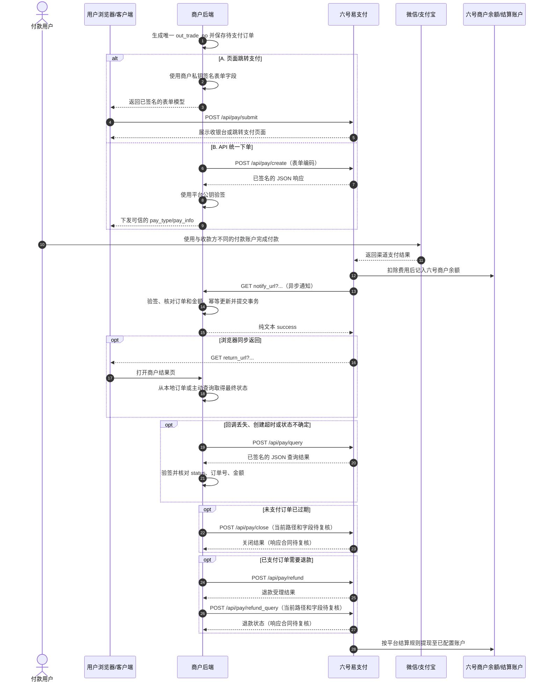

# 六号易支付 V2（RSA-SHA256）接口对接说明

> 文档定位：本文件是后续开发六号易支付 V2 对接时的协议依据；凡标记为“高可信待复核”的内容，在正式联调前仍须取得六号官方确认。
>
> 核对日期：2026-08-19。
>
> 覆盖范围：页面跳转支付、API 统一下单、异步支付回调、主动查询订单、订单退款、退款查询和关闭订单。
>
> 不覆盖范围：V1 MD5 协议、转账接口、收款通道配置、具体 Java DTO、Service、HTTP 客户端与数据库表设计。

## 0. 阅读规则与当前结论

本文使用以下标记区分资料可靠程度：

| 标记 | 含义 | 开发要求 |
| --- | --- | --- |
| **官方 SDK 已确认** | 六号官方 V2.0 PHP SDK 直接实现的接口路径、请求方式或处理行为 | 可以作为实现依据，但不能照抄 SDK 中不安全的 TLS 配置 |
| **官方页面已确认** | 六号公开页面明确给出的签名规则、支付方式或资金结算规则 | 可以作为实现依据 |
| **高可信待复核** | 从同版 V2 文档结构恢复并与官方 SDK 交叉核对，但六号当前文档目录无法稳定重新核对 | 可以用于设计；正式联调前必须向六号客服确认 |
| **本地安全要求** | 为保护订单、资金与密钥而必须由本项目补充的安全约束 | 即使官方示例省略也必须执行 |

当前能够直接下结论的内容如下：

1. 页面跳转支付和 API 统一下单都会创建六号平台订单，但它们是两种不同入口，同一笔商户订单应二选一。
2. 页面跳转支付由浏览器提交表单并进入六号收银台；API 统一下单由商户后端请求并取得跳转地址、二维码内容或其他支付载体。
3. 创建订单时应提交 `notify_url`；用户付款后，请求方向是“六号服务器 → 商户 `notify_url`”。
4. 六号官方 SDK 已确认异步通知通过 GET Query 传参，商户验签并完成落库后返回纯文本 `success`。
5. `return_url` 只负责浏览器同步返回，不能独立证明支付成功。
6. 主动查询是回调丢失、创建超时或状态不确定时的补偿手段；`code=0` 只表示查询接口成功，不能代替订单支付状态。
7. V2 使用商户私钥签名、平台公钥验签，不使用 `Authorization: Bearer API_KEY`，也禁止混用 V1 MD5 密钥。
8. 当前官方支付方式页面只列出 `alipay` 与 `wxpay`；旧 SDK 演示中的其他方式不得写入当前可用列表。
9. 六号平台订单号 `trade_no` 必须按字符串保存，不能假设固定长度，也不能用 JavaScript Number 或数据库数值类型承载。
10. 退款、退款查询和关闭订单属于支付后/订单生命周期接口；官方 V2.0 SDK 直接确认了退款发起接口，但当前公开网页中退款查询和关闭订单的字段仍需六号确认，本文不会把猜测写成已确认事实。

## 1. 协议总览与证据状态

### 1.1 完整调用流程



> **本地安全要求**：同一主体的同一支付账户给自己收款账户付款，可能被支付渠道视为自付、异常交易或无法完成。测试时应使用独立付款账户，并确保交易有真实、合法的测试背景。

### 1.2 核心流程的方向和职责

| 流程 | 请求方向 | 是否创建六号订单 | 主要返回形式 | 支付成功依据 | 证据等级 |
| --- | --- | --- | --- | --- | --- |
| 页面跳转支付 | 用户浏览器 → 六号 | 是 | HTML、收银台或浏览器跳转 | 可信回调或主动查询 | **官方 SDK 已确认** |
| API 统一下单 | 商户后端 → 六号 | 是 | 已签名 JSON | 可信回调或主动查询 | **官方 SDK 已确认** |
| 异步支付回调 | 六号 → 商户后端 | 否 | 商户返回纯文本确认 | 验签、订单/金额校验、幂等落库 | **官方 SDK 已确认** |
| 主动查询订单 | 商户后端 → 六号 | 否 | 已签名 JSON | 验签有效且业务字段全部匹配 | **官方 SDK 已确认**（SDK 默认按 `trade_no` 查询） |
| 订单退款 | 商户后端 → 六号 | 否 | 已签名 JSON | 验签、退款单号幂等和退款金额校验 | **官方 SDK 已确认** |
| 订单退款查询 | 商户后端 → 六号 | 否 | 待确认 | 验签、退款单号匹配、最终状态确认 | **高可信待复核** |
| 关闭订单 | 商户后端 → 六号 | 否 | 待确认 | 验签、确认未支付且已过期 | **高可信待复核** |

### 1.3 核心名词

| 名称 | 含义 | 所有者/来源 | 使用规则 | 证据等级 |
| --- | --- | --- | --- | --- |
| `pid` | 六号商户 ID | 六号后台“API 信息” | 不是支付宝 App ID、微信 App ID 或 API Key | **官方页面已确认** |
| `out_trade_no` | 商户自己的订单号 | 商户后端生成 | 在商户范围内唯一且不可变，用于本地匹配与幂等 | **官方 SDK 已确认** |
| `trade_no` | 六号平台订单号 | 六号创建订单后生成 | 必须按 `String`/`VARCHAR` 保存，长度不可写死 | **官方 SDK 已确认** |
| `api_trade_no` | 微信/支付宝渠道交易号 | 上游渠道返回给六号 | 主要用于渠道对账，不由商户生成 | **高可信待复核** |
| `notify_url` | 商户服务器异步通知地址 | 商户创建订单时提交 | 必须是公网可达的 HTTPS 后端地址 | **官方 SDK 已确认** |
| `return_url` | 浏览器同步返回地址 | 商户创建订单时提交 | 只用于展示，不能作为支付成功依据 | **官方 SDK 已确认** |
| `pay_type` | API 统一下单返回的支付载体类型 | 六号响应 | 决定如何解释 `pay_info` | **高可信待复核** |
| `pay_info` | 与 `pay_type` 对应的支付数据 | 六号响应 | 平台验签成功后才能交给前端 | **高可信待复核** |
| `trade_status` | 通知中的交易状态 | 六号通知 | 支付成功值为 `TRADE_SUCCESS` | **官方 SDK 已确认** |
| `status` | 查询结果中的订单状态 | 六号查询响应 | `0`～`4` 的完整状态表属于恢复字段 | **高可信待复核** |
| `param` | 商户自定义透传参数 | 商户提交，六号原样返回 | 只放非敏感关联信息，不能放密钥、Token 或个人隐私 | **高可信待复核** |
| `out_refund_no` | 商户退款单号 | 商户后端生成 | 每次退款意图唯一且不可复用 | **官方 SDK 已确认** |
| `refund_status` | 退款最终状态 | 六号退款查询/通知 | 字段名和值待六号当前 V2 合同确认 | **高可信待复核** |

### 1.4 资金流与结算账户

六号服务协议明确描述的资金路径是：

```text
付款用户通过微信/支付宝付款
→ 六号处理交易
→ 扣除约定手续费
→ 剩余交易款记入六号商户余额
→ 按结算/提现规则转至商户配置的合法收款账户
```

因此，后台设置的支付宝账户、微信标识、银行卡等是结算目的地，不等于每笔订单直接展示给付款人的个人收款二维码。支付测试完成后，应先在六号的订单管理、资金明细或商户余额中核对，再根据平台结算周期确认最终到账账户。

> 以上资金路径来自六号服务协议，具体费率、冻结、退款与到账周期以商户后台和双方协议为准，本文不据此承诺即时到账。

## 2. V2 公共传输、安全与 RSA 签名

### 2.1 接口根地址和公共传输格式

本文不把域名写死，统一使用：

```text
<API_BASE>
```

`<API_BASE>` 必须取自六号商户后台“API 信息”页面显示的接口地址。拼接路径时保证只有一个 `/`，例如：

```text
<API_BASE>/api/pay/create
```

公共传输约定：

| 项目 | 约定 | 证据等级 |
| --- | --- | --- |
| HTTPS | 生产环境只允许 HTTPS | **本地安全要求** |
| 请求编码 | `application/x-www-form-urlencoded; charset=UTF-8` | **官方 SDK 已确认**其使用表单编码；显式 UTF-8 为本地实现要求 |
| 创建/查询响应 | JSON | **官方 SDK 已确认** |
| 请求认证字段 | `pid`、`timestamp`、`sign_type`、`sign` | **官方 SDK 已确认** |
| 密钥是否作为请求字段发送 | 不发送商户私钥、商户公钥、平台公钥或平台私钥；请求只携带签名结果 `sign` | **本地安全要求** |
| Bearer API Key | 不使用 | **官方 SDK 已确认**的 V2 调用不包含此请求头 |
| `sign_type` | 固定发送 `RSA` | **官方 SDK 已确认** |
| 时间戳 | 10 位秒级 Unix 时间戳 | **官方 SDK 已确认** |

推荐请求头：

```http
Content-Type: application/x-www-form-urlencoded; charset=UTF-8
Accept: application/json
```

页面跳转接口的响应是 HTML/跳转行为，浏览器表单场景不要求发送 `Accept: application/json`。

### 2.2 请求签名步骤

六号官方签名页面和 V2.0 SDK共同确认以下步骤：

```text
取得所有请求参数
→ 排除 sign
→ 排除 sign_type
→ 排除空值、数组和字节/文件类参数
→ 参数名按 ASCII 码升序排列
→ 拼接为 k1=v1&k2=v2
→ 使用商户私钥执行 SHA256WithRSA 签名
→ 对签名字节进行标准 Base64 编码
→ 写入 sign，并显式发送 sign_type=RSA
```

签名原文使用的是表单解码后的逻辑参数值，而不是把已经编码的整个 HTTP Body 原样签名。对 URL、中文、空格、`+`、`%20`、`&` 等边界值进行正式联调前，仍应取得六号官方测试向量确认编码顺序。

#### 2.2.1 待签名字符串、`sign` 与密钥的区别

“待签名字符串”和请求字段 `sign` 不是同一个东西：

```text
待签名字符串 = 过滤、排序、拼接后的普通文本
sign = SHA256WithRSA(待签名字符串, 商户私钥) 后再进行 Base64 编码的结果
```

例如，脱敏参数：

```text
pid=1001
type=wxpay
out_trade_no=ORDER-EXAMPLE-001
money=1.00
timestamp=1787100000
```

按 ASCII 升序拼接后，待签名字符串可以是：

```text
money=1.00&out_trade_no=ORDER-EXAMPLE-001&pid=1001&timestamp=1787100000&type=wxpay
```

提交时发送的是原始业务参数、`sign_type=RSA` 和最终 `sign`，不单独发送待签名字符串，也不发送任何私钥或公钥。`sign_type` 和 `sign` 虽然是请求字段，但都必须排除在待签名字符串之外。

平台验签时不会要求商户私钥，而是根据 `pid` 找到已登记的商户公钥，重新构造待签名字符串并执行 RSA 验签：

```text
收到请求参数 + sign
→ 根据 pid 选择商户公钥
→ 按相同规则重建待签名字符串
→ SHA256WithRSA 验签
→ 验签成功后再检查 timestamp、订单号、金额和商户状态
```

验签成功只证明“签名来源可信且参数未被改动”，不等于订单已支付成功。订单状态仍必须通过异步通知或主动查询，并完成金额、订单号、`pid` 和幂等校验。

### 2.3 平台响应和通知验签

```text
收到平台响应、notify_url 或 return_url 参数
→ 检查 sign 与 timestamp 存在
→ 按相同规则排除 sign、sign_type、空值和数组
→ 参数名按 ASCII 升序拼接待验签字符串
→ 使用固定配置的六号平台公钥执行 SHA256WithRSA 验签
→ 校验 abs(当前秒级时间戳 - timestamp) <= 300
→ 验签和时间窗均通过后才读取业务状态
```

六号官方 SDK 的 `verify()` 明确拒绝与当前时间相差超过 300 秒的数据。服务器必须使用可靠时钟同步；时间戳超窗时，即使 RSA 签名正确，也不能直接更新订单。

### 2.4 密钥边界

| 密钥/标识 | 用途 | 可以放在哪里 | 禁止事项 |
| --- | --- | --- | --- |
| `pid` | 标识六号商户 | 后端配置；必要时可出现在已签名表单 | 不能当作秘密或支付渠道 App ID |
| 商户私钥 | 签署商户发往六号的 V2 请求 | Secret 管理或后端环境变量 | 禁止进入浏览器、移动端、日志、示例、Git 或数据库明文字段 |
| 商户公钥 | 让六号验证商户请求签名 | 在六号后台登记；本地可保留非秘密备份 | 不作为每次请求字段发送；不得用公钥代替私钥签名 |
| 六号平台公钥 | 验证六号响应与通知 | 后端受审计配置 | 禁止从单次响应动态信任新公钥 |
| V1 MD5 密钥/API Key | 旧版兼容协议 | 本文不使用 | 禁止与 V2 私钥、公钥混用 |

> 六号官方 SDK 的密钥生成流程可能一次性展示商户私钥。私钥丢失或泄露时应按平台流程重置，不能从平台公钥或商户公钥反推出私钥。

### 2.5 TLS 与日志安全

1. 六号官方 PHP SDK 中关闭 TLS 证书/主机名校验的示例不得复制到 Java 或其他生产客户端。
2. Java HTTP 客户端必须保留默认 CA 校验和主机名校验，禁止“信任所有证书”。
3. 创建、查询、回调与同步返回都禁止记录完整请求/响应体；日志只保留 `traceId`、脱敏订单号、结果码和错误分类。
4. `notify_url` 与 `return_url` 只能由服务端配置生成，禁止直接使用客户端提交的任意 URL。
5. 平台响应必须先验签，再读取 `pay_info`、金额、状态或任何跳转地址。

## 3. 页面跳转支付

### 3.1 接口定义

```text
POST 或 GET <API_BASE>/api/pay/submit
推荐 POST
```

| 项目 | 说明 | 证据等级 |
| --- | --- | --- |
| 调用方向 | 用户浏览器 → 六号 | **官方 SDK 已确认** |
| 用途 | 创建六号订单并进入收银台/支付页 | **官方 SDK 已确认** |
| POST 请求体 | `application/x-www-form-urlencoded; charset=UTF-8` | **官方 SDK 已确认**表单提交行为 |
| GET 形式 | 将相同字段放入 Query | **官方 SDK 已确认**，生产仍推荐 POST |
| 响应 | HTML、收银台或浏览器跳转，不是业务 JSON | **官方 SDK 已确认** |

即使表单最终由浏览器提交，订单号、金额、回调地址和 RSA 签名也必须由商户后端生成。前端不得持有商户私钥，不得自行修改金额后重签。

### 3.2 请求参数

除 `sign`、`sign_type` 和空值外，实际提交的非数组字段均参与签名。

| 字段 | 类型 | 必填 | 来源/说明 | 脱敏示例 | 参与签名 | 证据等级 |
| --- | --- | --- | --- | --- | --- | --- |
| `pid` | `String/Int` | 是 | 六号商户 ID | `<LIUHAO_PID>` | 是 | **高可信待复核**，SDK 公共参数确认 |
| `type` | `String` | 条件 | 当前可用值只写 `alipay`、`wxpay` | `wxpay` | 非空时参与 | 字段为**高可信待复核**；支付方式为**官方页面已确认** |
| `out_trade_no` | `String` | 是 | 商户自己的唯一订单号 | `ORDER-20260819-0001` | 是 | **官方 SDK 已确认** |
| `notify_url` | `String` | 是 | 服务器异步通知地址 | `https://merchant.example/payments/liuhao/notify` | 是 | **官方 SDK 已确认** |
| `return_url` | `String` | 是 | 浏览器同步返回地址 | `https://merchant.example/payments/result` | 是 | **官方 SDK 已确认**（示例行为）；必填性为**高可信待复核** |
| `name` | `String` | 是 | 商品名称 | `示例商品` | 是 | **高可信待复核** |
| `money` | 金额字符串 | 是 | 单位元，示例固定两位小数 | `1.00` | 是 | **官方 SDK 已确认** |
| `param` | `String` | 否 | 支付后透传的非敏感值 | `source=web` | 非空时参与 | **高可信待复核** |
| `timestamp` | `String` | 是 | 10 位秒级时间戳 | `1787100000` | 是 | **官方 SDK 已确认** |
| `sign_type` | `String` | 是 | 固定 `RSA` | `RSA` | 否 | **官方 SDK 已确认** |
| `sign` | `String` | 是 | 标准 Base64 RSA 签名 | `<BASE64_RSA_SIGNATURE>` | 否 | **官方 SDK 已确认** |

> **高可信待复核**：同版 V2 文档说明 `type` 不传时进入平台收银台，由用户选择支付方式。六号当前文档页无法稳定重新核对；正式实现“省略 `type`”前须向客服确认。直接指定时只使用六号当前页面列出的 `alipay` 或 `wxpay`。

### 3.3 脱敏 HTML 表单示例

以下 HTML 只是协议示例，真实系统应由后端提供已经签名且不可被客户端重新定价的表单模型：

```html
<form method="post" action="<API_BASE>/api/pay/submit">
  <input type="hidden" name="pid" value="&lt;LIUHAO_PID&gt;">
  <input type="hidden" name="type" value="wxpay">
  <input type="hidden" name="out_trade_no" value="ORDER-20260819-0001">
  <input type="hidden" name="notify_url" value="https://merchant.example/payments/liuhao/notify">
  <input type="hidden" name="return_url" value="https://merchant.example/payments/result">
  <input type="hidden" name="name" value="示例商品">
  <input type="hidden" name="money" value="1.00">
  <input type="hidden" name="param" value="source=web">
  <input type="hidden" name="timestamp" value="1787100000">
  <input type="hidden" name="sign_type" value="RSA">
  <input type="hidden" name="sign" value="&lt;BASE64_RSA_SIGNATURE&gt;">
  <button type="submit">前往支付</button>
</form>
```

### 3.4 响应和同步返回

- 正常响应是六号收银台、支付页面或浏览器跳转，不应按 API JSON 解析。
- GET 方式会把订单相关字段暴露在地址栏、浏览器历史和部分代理日志中，因此生产推荐 POST。
- `return_url` 参数也必须验平台签名，但它来自用户浏览器，可能缺失、延迟、重复或被重放。
- 结果页只能展示本地订单事实；若本地仍是待支付，应显示“结果确认中”并由后端查询，禁止浏览器直接把订单改为已支付。

## 4. API 统一下单

### 4.1 接口定义

```text
POST <API_BASE>/api/pay/create
Content-Type: application/x-www-form-urlencoded; charset=UTF-8
Accept: application/json
```

| 项目 | 说明 | 证据等级 |
| --- | --- | --- |
| 调用方向 | 商户后端 → 六号 | **官方 SDK 已确认** |
| 用途 | 创建六号订单并取得支付载体 | **官方 SDK 已确认** |
| 请求格式 | 表单编码 | **官方 SDK 已确认** |
| 响应格式 | JSON | **官方 SDK 已确认** |
| JSON 请求体 | 是否正式支持尚无可靠依据，默认不实现 | **高可信待复核** |

### 4.2 请求参数

| 字段 | 类型 | 必填 | 来源/说明 | 脱敏示例 | 参与签名 | 证据等级 |
| --- | --- | --- | --- | --- | --- | --- |
| `pid` | `String/Int` | 是 | 六号商户 ID | `<LIUHAO_PID>` | 是 | **官方 SDK 已确认**公共字段 |
| `method` | `String` | 是 | 支付发起类型，见下表 | `jump` | 是 | **高可信待复核** |
| `device` | `String` | 否 | `method=web` 时描述真实用户终端 | `mobile` | 非空时参与 | **高可信待复核** |
| `type` | `String` | 通常是 | 当前支付方式 `alipay` 或 `wxpay` | `wxpay` | 非空时参与 | 值为**官方页面已确认**；必填性为**高可信待复核** |
| `out_trade_no` | `String` | 是 | 商户唯一订单号 | `ORDER-20260819-0002` | 是 | **官方 SDK 已确认** |
| `notify_url` | `String` | 是 | 服务器异步通知地址 | `https://merchant.example/payments/liuhao/notify` | 是 | **官方 SDK 已确认** |
| `return_url` | `String` | 是 | 浏览器同步返回地址 | `https://merchant.example/payments/result` | 是 | **高可信待复核** |
| `name` | `String` | 是 | 商品名称 | `示例商品` | 是 | **高可信待复核** |
| `money` | 金额字符串 | 是 | 单位元，最多两位小数的规则待生产复核 | `1.00` | 是 | 字段为**官方 SDK 已确认**；格式为**高可信待复核** |
| `clientip` | `String` | 是 | 真实付款用户 IP，不是服务器固定 IP | `192.0.2.10` | 是 | **高可信待复核** |
| `param` | `String` | 否 | 非敏感业务透传值 | `source=api` | 非空时参与 | **高可信待复核** |
| `auth_code` | `String` | 条件 | `method=scan` 付款码场景使用 | `<PAYER_AUTH_CODE>` | 非空时参与 | **高可信待复核** |
| `sub_openid` | `String` | 条件 | JSAPI 场景的用户 OpenID | `<MASKED_OPENID>` | 非空时参与 | **高可信待复核** |
| `sub_appid` | `String` | 条件 | 微信 JSAPI 应用 AppId | `<SUB_APP_ID>` | 非空时参与 | **高可信待复核** |
| `timestamp` | `String` | 是 | 10 位秒级时间戳 | `1787100100` | 是 | **官方 SDK 已确认** |
| `sign_type` | `String` | 是 | 固定 `RSA` | `RSA` | 否 | **官方 SDK 已确认** |
| `sign` | `String` | 是 | 标准 Base64 RSA 签名 | `<BASE64_RSA_SIGNATURE>` | 否 | **官方 SDK 已确认** |

`method` 恢复值：

| 值 | 含义 | 使用提示 | 证据等级 |
| --- | --- | --- | --- |
| `web` | 通用网页支付 | 根据 `device` 返回合适载体 | **高可信待复核** |
| `jump` | 跳转支付 | 只期望取得跳转地址时优先考虑 | **高可信待复核** |
| `jsapi` | JSAPI 支付 | 通常还需 `sub_openid`、`sub_appid` | **高可信待复核** |
| `app` | APP 支付 | 返回 APP 可用的支付参数或唤起信息 | **高可信待复核** |
| `scan` | 付款码支付 | 需传 `auth_code` | **高可信待复核** |

`device` 恢复值：

| 值 | 含义 |
| --- | --- |
| `pc` | 电脑浏览器 |
| `mobile` | 手机浏览器 |
| `qq` | 手机 QQ 内浏览器 |
| `wechat` | 微信内浏览器 |
| `alipay` | 支付宝客户端 |

以上 `device` 值均为**高可信待复核**。`device` 描述最终付款用户所在环境，不应固定写成商户服务器的运行环境。

### 4.3 表单请求示例

```http
POST <API_BASE>/api/pay/create HTTP/1.1
Content-Type: application/x-www-form-urlencoded; charset=UTF-8
Accept: application/json

pid=<LIUHAO_PID>&method=jump&device=mobile&type=wxpay&out_trade_no=ORDER-20260819-0002&notify_url=https%3A%2F%2Fmerchant.example%2Fpayments%2Fliuhao%2Fnotify&return_url=https%3A%2F%2Fmerchant.example%2Fpayments%2Fresult&name=%E7%A4%BA%E4%BE%8B%E5%95%86%E5%93%81&money=1.00&clientip=192.0.2.10&param=source%3Dapi&timestamp=1787100100&sign_type=RSA&sign=<URL_ENCODED_BASE64_RSA_SIGNATURE>
```

> 上例展示的是 HTTP 表单编码后的 Body。计算 `sign` 时应使用编码前的逻辑参数值按签名规则拼接，不应直接把整段百分号编码 Body 当作签名原文。

### 4.4 响应参数

| 字段 | JSON 类型 | 含义 | 处理要求 | 证据等级 |
| --- | --- | --- | --- | --- |
| `code` | `Int` | 接口结果码 | `0` 表示下单接口成功，不表示用户已付款 | **高可信待复核**，SDK 以 `code==0` 触发验签 |
| `msg` | `String` | 结果说明 | 仅用于诊断，不据此判定付款 | **高可信待复核** |
| `trade_no` | `String` | 六号平台订单号 | 验签后与本地 `out_trade_no` 关联保存 | **官方 SDK 已确认** |
| `pay_type` | `String` | `pay_info` 的载体类型 | 必须按允许值分派处理 | **高可信待复核** |
| `pay_info` | `String/Mixed` | 跳转地址、HTML、二维码内容或客户端参数 | 先验签再交给前端；不得直接执行不受信任内容 | **高可信待复核** |
| `timestamp` | `String` | 六号响应时间戳 | 参与验签且须通过 300 秒窗口 | **官方 SDK 已确认** |
| `sign` | `String` | 六号平台签名 | 使用平台公钥验证 | **官方 SDK 已确认** |
| `sign_type` | `String` | 签名类型 | V2 应为 `RSA` | **官方 SDK 已确认** |

`pay_type` 恢复值：

| 值 | `pay_info` 含义 | 商户处理要求 | 证据等级 |
| --- | --- | --- | --- |
| `jump` | 支付跳转 URL | 验签后再按 HTTPS/域名策略跳转 | **高可信待复核** |
| `html` | 用于跳转的 HTML 内容 | 不应直接注入不受控页面；正式采用前进行安全评估 | **高可信待复核** |
| `qrcode` | 二维码原始内容 | 前端渲染二维码，不把内容当普通链接盲目打开 | **高可信待复核** |
| `scheme` | 客户端唤起 Scheme | 按客户端 Scheme 允许列表处理 | **高可信待复核** |
| `jsapi` | JSAPI 支付参数 | 交给对应支付客户端 SDK | **高可信待复核** |
| `app` | APP 支付参数 | 交给受信任的移动端支付适配层 | **高可信待复核** |
| `scan` | 付款码支付结果信息 | 仍须以后续可信状态为最终依据 | **高可信待复核** |

> 同版文档常把 URL Scheme 返回值写作 `urlscheme`，计划中的六号值为 `scheme`。该差异属于协议阻塞项；实现前应由客服或真实脱敏响应确认，代码不得把二者静默当作同一个官方值。

### 4.5 脱敏响应示例

```json
{
  "code": 0,
  "msg": "success",
  "trade_no": "2099081901234567890",
  "pay_type": "jump",
  "pay_info": "https://cashier.example/pay/fake-token",
  "timestamp": "1787100101",
  "sign": "<PLATFORM_BASE64_RSA_SIGNATURE>",
  "sign_type": "RSA"
}
```

正确处理顺序：

```text
收到 HTTP 响应
→ 限制响应大小并解析 JSON
→ 检查 sign_type=RSA、sign 和 timestamp 存在
→ 使用六号平台公钥验签
→ 校验 300 秒时间窗
→ 检查 code=0
→ 保存 trade_no（字符串）
→ 按 pay_type 处理 pay_info
```

创建请求超时或连接中断时，不得立即生成新的 `out_trade_no` 再创建。应先按原订单号主动查询；只有平台明确不存在且重复订单号规则已经确认后，才能决定是否重试创建。

## 5. 异步支付回调

### 5.1 回调地址和请求方向

异步通知地址不是六号提供给商户主动访问的固定接口，而是商户创建订单时提交的 `notify_url`，例如：

```text
notify_url=https://merchant.example/payments/liuhao/notify
```

用户付款后，请求方向是：

```text
六号服务器 → GET https://merchant.example/payments/liuhao/notify?...通知字段...
```

| 项目 | 合同 | 证据等级 |
| --- | --- | --- |
| HTTP 方法 | GET | **官方 SDK 已确认** |
| 参数位置 | URL Query | **官方 SDK 已确认** |
| 通知签名 | 六号平台私钥签名 | **官方页面已确认** |
| 商户验签 | 使用六号平台公钥 | **官方页面已确认** |
| 成功确认正文 | 纯文本 `success` | **官方 SDK 已确认** |
| 验签失败示例正文 | 纯文本 `fail` | **官方 SDK 已确认**的示例行为 |
| 平台重试策略 | 次数、间隔和截止时间未知 | **高可信待复核/协议阻塞项** |

### 5.2 通知字段

六号官方 SDK 的通知示例直接读取 `out_trade_no`、`trade_no`、`trade_status`、`type` 和 `money`，并对完整 GET 参数集合验签。其余完整字段来自同版 V2 通知文档恢复，因此逐字段标注如下：

| 字段 | 类型 | 含义 | 校验要求 | 证据等级 |
| --- | --- | --- | --- | --- |
| `pid` | `String/Int` | 六号商户 ID | 必须与当前商户配置精确匹配 | **高可信待复核** |
| `trade_no` | `String` | 六号平台订单号 | 与本地已保存值一致；未保存时可在可信通知后补记 | **官方 SDK 已确认** |
| `out_trade_no` | `String` | 商户订单号 | 用于查找本地订单，必须精确匹配 | **官方 SDK 已确认** |
| `api_trade_no` | `String` | 微信/支付宝渠道交易号 | 验签后用于对账，不作为本地主键 | **高可信待复核** |
| `type` | `String` | 支付方式 | 应为本订单允许的方式 | **官方 SDK 已确认** |
| `trade_status` | `String` | 交易状态 | 支付成功时必须为 `TRADE_SUCCESS` | **官方 SDK 已确认** |
| `addtime` | `String` | 六号订单创建时间 | 只作记录，不替代本地时间 | **高可信待复核** |
| `endtime` | `String` | 六号订单完成时间 | 只作记录，不替代验签和状态判断 | **高可信待复核** |
| `name` | `String` | 商品名称 | 可用于审计，不作为支付成功核心条件 | **高可信待复核** |
| `money` | 金额字符串 | 实付/订单金额 | 使用十进制定点值与本地应付金额精确比较 | **官方 SDK 已确认** |
| `param` | `String` | 商户透传参数 | 视为不可信输入，不能执行其中内容 | **高可信待复核** |
| `buyer` | `String` | 支付用户标识，通常为 OpenID 等 | 作为敏感信息脱敏保存或不保存 | **高可信待复核** |
| `timestamp` | `String` | 六号通知时间戳 | 与当前时间误差不得超过 300 秒 | **官方 SDK 已确认** |
| `sign` | `String` | 六号平台签名 | 必须用平台公钥验签 | **官方 SDK 已确认** |
| `sign_type` | `String` | 签名类型 | 必须为 `RSA` | **官方 SDK 已确认** |

平台可能在未来增加非空扩展字段。验签实现必须从实际收到的完整参数集合出发，排除 `sign`、`sign_type`、空值和数组后排序，不能只硬编码挑选上表中的旧字段；否则平台新增签名字段后会导致错误验签或错误信任。

### 5.3 脱敏 GET 通知示例

```http
GET /payments/liuhao/notify?pid=<LIUHAO_PID>&trade_no=2099081901234567890&out_trade_no=ORDER-20260819-0002&api_trade_no=<CHANNEL_TRADE_NO>&type=wxpay&trade_status=TRADE_SUCCESS&addtime=2026-08-19%2012%3A00%3A00&endtime=2026-08-19%2012%3A01%3A05&name=%E7%A4%BA%E4%BE%8B%E5%95%86%E5%93%81&money=1.00&param=source%3Dapi&buyer=<MASKED_BUYER>&timestamp=1787100165&sign=<URL_ENCODED_PLATFORM_SIGNATURE>&sign_type=RSA HTTP/1.1
Host: merchant.example
```

响应成功：

```http
HTTP/1.1 200 OK
Content-Type: text/plain; charset=UTF-8

success
```

本项目应返回正文精确值 `success`，不要附加 JSON、HTML、调试文本、前后空格或额外换行依赖。响应的精确 `Content-Type` 是否被六号强制检查仍应联调确认。

### 5.4 必须遵守的处理顺序

```text
接收原始 GET Query 参数
→ 拒绝参数重名、超长字段和无法解析的输入
→ 检查 sign_type=RSA、sign、timestamp 存在
→ 使用平台公钥对实际收到的完整参数集合验签
→ 检查 timestamp 与当前时间误差 <= 300 秒
→ 校验 pid 等于当前六号商户配置
→ 根据 out_trade_no 查询已经存在的本地订单
→ 校验 trade_no（如本地已保存）
→ 使用十进制定点金额校验 money
→ 检查 trade_status=TRADE_SUCCESS
→ 在数据库本地事务内做幂等状态迁移
→ 提交事务
→ 返回纯文本 success
```

任何一步失败都不能把订单标记为已支付。是否返回 `fail`、其他非成功正文或非 2xx，应结合六号重试策略确认；无论返回什么，都不能在数据库事务提交前回复 `success`。

### 5.5 幂等与同步返回

回调幂等不依赖 Redis 分布式锁作为最终保障。应由数据库唯一约束、订单状态条件更新和本地事务保证“一笔商户订单只完成一次”。语言无关伪代码：

```text
BEGIN TRANSACTION
order = SELECT 本地订单 FOR UPDATE WHERE out_trade_no = ?

if order 不存在:
    ROLLBACK
    不返回 success，记录脱敏告警并触发人工核对

if order 已支付且 trade_no/money/pid 全部相同:
    COMMIT
    返回 success                 # 合法重复通知

if order 已支付但 trade_no 或 money 冲突:
    ROLLBACK
    不改变原订单，记录高优先级安全事件

校验订单可从当前状态迁移到已支付
UPDATE 订单 SET 已支付事实 WHERE out_trade_no = ? AND 当前状态 = 待支付
写入一次性后续动作或由事务提交后的可靠机制触发
COMMIT
返回 success
```

`return_url` 也由 GET 参数承载并需要平台公钥验签，但它仍然经过用户浏览器。同步结果页不得记账、发货或增加权益，只能读取本地状态；必要时让后端主动查询。

## 6. 主动查询订单

### 6.1 接口定义

```text
POST <API_BASE>/api/pay/query
Content-Type: application/x-www-form-urlencoded; charset=UTF-8
Accept: application/json
```

| 项目 | 说明 | 证据等级 |
| --- | --- | --- |
| 调用方向 | 商户后端 → 六号 | **官方 SDK 已确认** |
| 请求格式 | 表单编码 | **官方 SDK 已确认** |
| 响应格式 | JSON | **官方 SDK 已确认** |
| SDK 快捷参数 | `queryOrder($trade_no)` 默认发送平台订单号 | **官方 SDK 已确认** |
| 商户订单号查询 | `out_trade_no` 与 `trade_no` 二选一 | **高可信待复核** |

主动查询不是“六号反向回调”。它由商户后端发起，用于：

- 创建接口超时或响应丢失；
- 异步回调未到达；
- 回调验签失败后从可信方向重新获取事实；
- 本地待支付订单定时收敛；
- 人工对账。

### 6.2 请求参数

| 字段 | 类型 | 必填 | 说明 | 脱敏示例 | 参与签名 | 证据等级 |
| --- | --- | --- | --- | --- | --- | --- |
| `pid` | `String/Int` | 是 | 六号商户 ID | `<LIUHAO_PID>` | 是 | **官方 SDK 已确认**公共字段 |
| `trade_no` | `String` | 二选一 | 六号平台订单号 | `2099081901234567890` | 非空时参与 | **官方 SDK 已确认** |
| `out_trade_no` | `String` | 二选一 | 商户自己的订单号 | `ORDER-20260819-0002` | 非空时参与 | **高可信待复核** |
| `timestamp` | `String` | 是 | 10 位秒级时间戳 | `1787100200` | 是 | **官方 SDK 已确认** |
| `sign_type` | `String` | 是 | 固定 `RSA` | `RSA` | 否 | **官方 SDK 已确认** |
| `sign` | `String` | 是 | 商户私钥签名 | `<BASE64_RSA_SIGNATURE>` | 否 | **官方 SDK 已确认** |

不要同时传入 `trade_no` 与 `out_trade_no`，避免平台选择优先级不明确。拿到可信创建响应后，优先保存并按 `trade_no` 查询；创建响应丢失时，才需要依赖 `out_trade_no` 查询能力。

### 6.3 按平台订单号查询示例

```http
POST <API_BASE>/api/pay/query HTTP/1.1
Content-Type: application/x-www-form-urlencoded; charset=UTF-8
Accept: application/json

pid=<LIUHAO_PID>&trade_no=2099081901234567890&timestamp=1787100200&sign_type=RSA&sign=<URL_ENCODED_BASE64_RSA_SIGNATURE>
```

待签名参数的 ASCII 顺序：

```text
pid=<LIUHAO_PID>&timestamp=1787100200&trade_no=2099081901234567890
```

### 6.4 按商户订单号查询示例

> **高可信待复核**：下面的字段结构来自同版 V2 查询合同。正式依赖它处理“创建响应完全丢失”之前，必须取得六号当前生产环境确认。

```http
POST <API_BASE>/api/pay/query HTTP/1.1
Content-Type: application/x-www-form-urlencoded; charset=UTF-8
Accept: application/json

pid=<LIUHAO_PID>&out_trade_no=ORDER-20260819-0002&timestamp=1787100200&sign_type=RSA&sign=<URL_ENCODED_BASE64_RSA_SIGNATURE>
```

待签名参数的 ASCII 顺序：

```text
out_trade_no=ORDER-20260819-0002&pid=<LIUHAO_PID>&timestamp=1787100200
```

### 6.5 查询响应参数

| 字段 | JSON 类型 | 含义 | 处理要求 | 证据等级 |
| --- | --- | --- | --- | --- |
| `code` | `Int` | 查询接口结果码 | `0` 只表示查询调用成功 | **高可信待复核**，SDK 以 `code==0` 触发验签 |
| `msg` | `String` | 结果说明 | 仅用于诊断 | **高可信待复核** |
| `trade_no` | `String` | 六号平台订单号 | 必须按字符串保存并与本地值核对 | **官方 SDK 已确认** |
| `out_trade_no` | `String` | 商户订单号 | 必须与当前查询订单精确匹配 | **高可信待复核** |
| `api_trade_no` | `String` | 微信/支付宝渠道交易号 | 验签后用于对账 | **高可信待复核** |
| `type` | `String` | 支付方式 | 与本地允许值核对 | **高可信待复核** |
| `status` | `Int` | 六号订单状态 | 根据状态表处理，不能把所有非零都当作成功 | **高可信待复核** |
| `pid` | `Int/String` | 六号商户 ID | 必须与当前配置匹配 | **高可信待复核** |
| `addtime` | `String` | 订单创建时间 | 审计字段 | **高可信待复核** |
| `endtime` | `String` | 订单完成时间 | 仅在完成时可能返回 | **高可信待复核** |
| `name` | `String` | 商品名称 | 只作审计辅助 | **高可信待复核** |
| `money` | 金额字符串 | 订单金额 | 与本地应付金额精确比较 | **高可信待复核** |
| `refundmoney` | 金额字符串 | 已退款金额 | 部分退款时可能返回 | **高可信待复核** |
| `param` | `String` | 商户透传参数 | 视为不可信数据，不执行其中内容 | **高可信待复核** |
| `buyer` | `String` | 支付用户标识 | 敏感信息，最小化使用并脱敏 | **高可信待复核** |
| `clientip` | `String` | 支付用户 IP | 敏感信息，按隐私要求处理 | **高可信待复核** |
| `timestamp` | `String` | 六号响应时间戳 | 参与验签并校验 300 秒窗口 | **官方 SDK 已确认** |
| `sign` | `String` | 六号平台签名 | 使用平台公钥验签 | **官方 SDK 已确认** |
| `sign_type` | `String` | 签名类型 | V2 应为 `RSA` | **官方 SDK 已确认** |

恢复的 `status` 状态表：

| `status` | 含义 | 是否可当作本次付款成功 | 本地处理 | 证据等级 |
| --- | --- | --- | --- | --- |
| `0` | 未支付 | 否 | 保持待支付，按有界策略继续等待/查询 | **高可信待复核** |
| `1` | 已支付 | 是，但仍须全部安全条件通过 | 幂等更新已支付 | **高可信待复核** |
| `2` | 已退款 | 否 | 进入退款/对账流程，不能重新发货 | **高可信待复核** |
| `3` | 已冻结 | 否 | 暂停交付并人工核对 | **高可信待复核** |
| `4` | 预授权 | 否 | 不能按最终扣款处理，业务语义须向客服确认 | **高可信待复核** |

### 6.6 查询响应示例和最终判定

```json
{
  "code": 0,
  "msg": "success",
  "trade_no": "2099081901234567890",
  "out_trade_no": "ORDER-20260819-0002",
  "api_trade_no": "<CHANNEL_TRADE_NO>",
  "type": "wxpay",
  "status": 1,
  "pid": "<LIUHAO_PID>",
  "addtime": "2026-08-19 12:00:00",
  "endtime": "2026-08-19 12:01:05",
  "name": "示例商品",
  "money": "1.00",
  "refundmoney": "0.00",
  "param": "source=api",
  "buyer": "<MASKED_BUYER>",
  "clientip": "192.0.2.10",
  "timestamp": "1787100201",
  "sign": "<PLATFORM_BASE64_RSA_SIGNATURE>",
  "sign_type": "RSA"
}
```

支付成功必须同时满足：

```text
平台 RSA 签名有效
AND timestamp 与当前时间误差 <= 300 秒
AND sign_type = RSA
AND code = 0
AND status = 1
AND pid = 当前商户配置
AND out_trade_no = 本地订单号
AND trade_no 与本地可信值兼容/一致
AND money 与本地应付金额精确一致
```

HTTP 200、`code=0`、`msg=success`、`status=1` 中任何一个单独出现，都不能证明用户已经付款。

## 7. 退款、退款查询与关闭订单

### 7.1 证据状态和总体边界

截图目录显示了“订单退款”“订单退款查询”“关闭订单”三个栏目，但六号当前网页文档在核对期间无法稳定访问，官方 V2.0 SDK 也只直接提供了退款发起方法，没有提供退款查询和关闭订单方法。因此本节采用分级标注：

| 接口 | 当前证据 | 开发结论 |
| --- | --- | --- |
| 订单退款 | **官方 SDK 已确认**：路径为 `/api/pay/refund`，SDK 传入 `trade_no`、`money`、`out_refund_no` | 可以先按本节实现，但必须在当前商户测试环境验证余额、重复退款和金额边界 |
| 订单退款查询 | **高可信待复核**：后台目录存在，官方 SDK 未提供可直接复现的方法 | 未获得当前路径和字段书面确认前，不得投入生产 |
| 关闭订单 | **高可信待复核**：后台目录存在，官方 SDK 未提供可直接复现的方法 | 未获得当前路径和字段书面确认前，不得投入生产 |

三者不能替代支付成功流程：

```text
先确认订单事实
→ 退款只针对已支付订单
→ 退款超时查询退款状态
→ 关闭只针对仍未支付且已过期订单
```

六号服务协议说明，退款金额会从六号商户号余额中扣除；余额不足可能导致退款无法完成。[六号服务协议](https://www.liuhao.net/agreement.html)

### 7.2 订单退款（官方 SDK 已确认）

接口：

```text
POST <API_BASE>/api/pay/refund
Content-Type: application/x-www-form-urlencoded; charset=UTF-8
Accept: application/json
```

官方 SDK 的 `refund($out_refund_no, $trade_no, $money)` 方法构造的核心参数如下：

| 字段 | 类型 | 必填 | 含义 | 参与签名 | 证据等级 |
| --- | --- | --- | --- | --- | --- |
| `pid` | `String/Int` | 是 | 六号商户 ID，由公共参数注入 | 是 | **官方 SDK 已确认** |
| `trade_no` | `String` | 是（SDK路径） | 六号平台订单号 | 是 | **官方 SDK 已确认** |
| `money` | 金额字符串 | 是 | 本次退款金额，单位元 | 是 | **官方 SDK 已确认**字段；金额边界需联调 |
| `out_refund_no` | `String` | 是 | 商户退款单号，商户侧必须唯一 | 是 | **官方 SDK 已确认** |
| `timestamp` | `String` | 是 | 10 位秒级时间戳，由 SDK 注入 | 是 | **官方 SDK 已确认** |
| `sign_type` | `String` | 是 | 固定 `RSA` | 否 | **官方 SDK 已确认** |
| `sign` | `String` | 是 | 商户私钥生成的 Base64 签名 | 否 | **官方 SDK 已确认** |

脱敏请求示例：

```http
POST <API_BASE>/api/pay/refund HTTP/1.1
Content-Type: application/x-www-form-urlencoded; charset=UTF-8
Accept: application/json

pid=<LIUHAO_PID>&trade_no=2099081901234567890&money=1.00&out_refund_no=REFUND-EXAMPLE-001&timestamp=1787100400&sign_type=RSA&sign=<BASE64_RSA_SIGNATURE>
```

退款请求的本地处理顺序：

```text
校验本地订单已支付
→ 校验退款单号唯一
→ 校验退款金额不超过可退金额
→ 使用商户私钥签名并调用退款接口
→ 验证平台 RSA 响应
→ code=0 只表示退款请求被接口受理，不等于最终退款到账
→ 超时或状态不明确时查询退款状态，不换新的退款单号盲目重试
```

官方 SDK 当前只直接使用 `code=0` 和 `msg` 判断退款接口是否受理成功；完整退款单号、最终状态、失败原因和是否存在退款回调，必须向六号确认。

### 7.3 订单退款查询（高可信待复核）

后台目录有“订单退款查询”，但当前公开页面无法稳定访问，SDK 未提供对应方法。不得把其他易支付平台的路径或字段直接当作六号事实。

当前只记录待确认合同：

```text
候选路径：<API_BASE>/api/pay/refund_query
请求方式：POST
请求编码：application/x-www-form-urlencoded; charset=UTF-8
签名：V2 RSA，排除 sign/sign_type 后按公共规则生成
```

以下字段必须由六号确认后才能落地：

```text
退款定位字段：trade_no、out_trade_no、out_refund_no 是否支持，是否二选一
退款状态字段：字段名、取值、处理中/成功/失败/异常的语义
金额字段：refund_money、money 或其他字段名及精度
响应字段：code、msg、平台退款单号、商户退款单号、timestamp、sign、sign_type
是否存在退款异步通知：通知方法、字段、确认正文和重试策略
```

在退款查询合同确认前，退款接口超时只能进入“退款结果未知”状态，不能依据 `code=0` 或 HTTP 200 直接把本地退款标记为成功。

### 7.4 关闭订单（高可信待复核）

后台目录有“关闭订单”，但当前公开页面和 V2.0 SDK 未提供可复现的字段合同。关闭订单只应在以下条件满足后调用：

```text
本地订单仍处于待支付
→ 已超过业务支付截止时间
→ 先按原 trade_no 或 out_trade_no 查询一次
→ 确认没有支付成功后再发起关闭
```

当前只能把以下内容作为待确认模板：

```text
候选路径：<API_BASE>/api/pay/close
请求方式：POST
请求编码：application/x-www-form-urlencoded; charset=UTF-8
可能的订单定位：trade_no 或 out_trade_no（二选一规则待确认）
公共字段：pid、timestamp、sign_type=RSA、sign
```

必须向六号确认：

- 已支付、处理中或已退款订单调用时的结果；
- 关闭成功后的查询状态值；
- 关闭请求超时后的幂等行为；
- 是否返回 JSON、`code`/`msg` 字段及平台订单号；
- 关闭后用户迟到付款如何处理；
- 是否需要或产生关闭通知。

关闭成功不等于退款，也不能把关闭结果当作支付成功。关闭请求超时必须先查询原订单，禁止直接生成新的商户订单号掩盖状态不确定。

### 7.5 退款和关闭的本地状态约束

建议把支付状态和退款状态分开建模：

```text
支付状态：待支付 → 已支付 / 已关闭
退款状态：无退款 → 退款处理中 → 退款成功 / 退款失败 / 退款结果未知
```

强制不变量：

- 同一 `out_refund_no` 只能对应一个本地退款意图；
- 退款成功前不能重复扣减库存、发放权益或记账；
- 退款接口返回“受理成功”时只进入退款处理中，最终结果必须来自已确认的退款查询或回调；
- 已支付订单不能执行关闭；
- 已关闭订单不能再次按原订单支付成功处理，迟到付款必须由平台合同和客服确认后处置；
- 金额始终使用十进制定点类型，不能使用 `double`/`float`。

## 8. 签名、示例、差异与错误处理

### 8.1 API 统一下单签名示例

以下全部为虚构数据。原始逻辑参数：

```text
pid=<LIUHAO_PID>
method=jump
device=
type=wxpay
out_trade_no=ORDER-20260819-0003
notify_url=https://merchant.example/payments/liuhao/notify
return_url=
name=示例商品
money=1.00
clientip=192.0.2.10
param=source=api
timestamp=1787100300
sign_type=RSA
sign=
```

第一步，排除：

- `sign`；
- `sign_type`；
- 空值 `device`；
- 空值 `return_url`。

第二步，参数名按 ASCII 升序排列：

```text
clientip
method
money
name
notify_url
out_trade_no
param
pid
timestamp
type
```

第三步，拼接待签名字符串：

```text
clientip=192.0.2.10&method=jump&money=1.00&name=示例商品&notify_url=https://merchant.example/payments/liuhao/notify&out_trade_no=ORDER-20260819-0003&param=source=api&pid=<LIUHAO_PID>&timestamp=1787100300&type=wxpay
```

第四步：

```text
signatureBytes = SHA256WithRSA_SIGN(merchantPrivateKey, UTF8(toSignString))
sign = STANDARD_BASE64(signatureBytes)
```

最终提交时增加：

```text
sign_type=RSA
sign=<BASE64_RSA_SIGNATURE>
```

> UTF-8 是本项目的统一传输选择；包含 URL 保留字符、空格、中文和 `+` 的正式签名测试向量仍需六号确认“签名后再表单编码”的精确边界。

### 8.2 平台订单号的存储规则

本文示例平台订单号：

```text
2099081901234567890
```

这只是虚构的 19 位数字串。六号官方 SDK 曾出现不同长度的数字型示例，因此必须遵守：

- Java 使用 `String`；
- PostgreSQL 使用有合理上限的 `VARCHAR`；
- JavaScript/TypeScript 使用 `string`；
- 不按固定 17 位或 19 位校验；
- 不解析其日期语义；
- 不转换为 `Long`、`BIGINT` 或 JavaScript Number；
- 保留平台返回的原始字符，不去前导零。

### 8.3 回调与查询的互补关系

| 场景 | 首选动作 | 补偿动作 |
| --- | --- | --- |
| 正常支付完成 | 处理 GET 异步回调 | 定时查询仍未收敛的待支付订单 |
| 回调未到达 | 保持本地待支付 | 主动查询原订单 |
| 回调验签失败 | 拒绝通知并记录安全事件 | 从商户后端主动查询 |
| 创建接口超时 | 不生成新订单号 | 优先按原 `out_trade_no` 查询（生产支持状态待复核） |
| 用户进入 `return_url` | 展示本地订单状态 | 后端查询，不能信任浏览器参数 |
| 查询也超时 | 保持“结果未知” | 有界退避重试，超过期限后人工对账 |

### 8.4 与幸运木 Pay V2 的关键差异

| 项目 | 六号易支付 V2 | 幸运木 Pay V2 | 实现影响 |
| --- | --- | --- | --- |
| 页面支付路径 | `/api/pay/submit` | `/xpay/epayn/api/pay/submit` | 不得复用固定 URL |
| API 下单路径 | `/api/pay/create` | `/xpay/epayn/api/pay/create` | 每个平台独立客户端配置 |
| 查询路径 | `/api/pay/query` | `/xpay/epayn/api/pay/query` | 每个平台独立路由 |
| 回调方法 | GET 已由六号 SDK 确认 | 幸运木公开 V2 资料仍待确认 | Controller 参数绑定不能共用假设 |
| 回调确认正文 | 六号 SDK 确认 `success` | 幸运木 V2 仍待确认 | 分平台返回合同 |
| 响应/通知时间窗 | 六号 SDK 明确 300 秒 | 幸运木公开 V2 资料未明确 | 六号验签必须检查 300 秒 |
| 查询状态 | 恢复字段含 `0`～`4` | 当前幸运木公开值主要为 `0/1` | 状态枚举不能强行共用 |
| 当前支付方式 | 六号官方页面仅列 `alipay`、`wxpay` | 以幸运木当前后台/文档为准 | 六号不启用 SDK 历史额外方式 |
| 密钥 | 六号商户私钥/平台公钥 | 幸运木商户私钥/平台公钥 | 两个平台密钥绝对禁止复用 |

### 8.5 失败和异常处理表

| 情况 | 能否标记已支付 | 处理方式 |
| --- | --- | --- |
| HTTP 连接失败、非 2xx 或超时 | 否 | 保持结果未知；查询原订单，禁止直接换 `out_trade_no` |
| 创建/查询返回非 JSON | 否 | 限量保存脱敏诊断信息并报警；随后主动查询或人工核对 |
| `code != 0` | 否 | 按平台错误处理；不使用 `pay_info`，不把失败说明当支付状态 |
| `sign_type != RSA` | 否 | 拒绝处理并记录协议异常 |
| 平台签名错误 | 否 | 整个响应/通知视为不可信，不能读取状态、金额或跳转内容 |
| `timestamp` 超过 300 秒 | 否 | 按过期/重放风险拒绝，检查服务器时钟后主动查询 |
| 回调 `pid` 不匹配 | 否 | 拒绝处理并报警 |
| 回调/查询金额不一致 | 否 | 不覆盖本地订单、不交付；进入人工对账 |
| 回调订单不存在 | 否 | 禁止根据通知自动创建本地订单；报警并人工核对 |
| 重复合法回调 | 保持原结果 | 幂等返回 `success`，不重复记账、发货或增加权益 |
| 已支付订单收到不同 `trade_no` 或金额 | 不改变原结果 | 记录高优先级冲突事件并人工核对 |
| 查询 `status=0` | 否 | 保持待支付并执行有界查询策略 |
| 查询 `status=2` | 否 | 进入退款对账，不重新交付 |
| 查询 `status=3` | 否 | 暂停交付，核实冻结原因 |
| 查询 `status=4` | 否 | 不当作最终扣款；确认预授权后续协议 |
| `return_url` 页面显示成功但本地未支付 | 否 | 显示“结果确认中”，由后端查询 |

### 8.6 最小对账事实

协议层至少需要可靠保留下列事实，具体表结构不在本文范围内：

```text
out_trade_no          商户订单号，唯一且不可变
trade_no              六号平台订单号，字符串
api_trade_no          微信/支付宝渠道交易号（如有）
pid                   所属六号商户
expected_money        本地应付金额，十进制定点
paid_money            验签并核对后的平台金额
payment_status        本地支付状态
platform_status       最近一次可信查询状态
created_at            本地创建时间
paid_at               确认支付时间
last_query_at         最近主动查询时间
notification_digest   回调去重摘要，不保存完整敏感 Query
```

## 9. 官方资料、风险边界与协议阻塞项

### 9.1 资料优先级

若资料发生冲突，按以下优先级处理：

1. [六号官方 V2.0 SDK](https://liuhao.net/static/files/SDK_2.0.zip)。
2. [六号商户后台“API 信息”](https://liuhao.net/user/#/account/api-info)中当前账户显示的接口地址、商户号与 RSA 公钥配置。
3. [六号官方签名规则](https://www.liuhao.net/doc/sign_note.html)和[支付方式列表](https://www.liuhao.net/doc/paytype.html)中仍可核对的内容。
4. 六号客服提供、能够标明版本和日期的当前 V2 协议说明。
5. 真实测试环境取得并完成脱敏的请求、响应与回调，且由六号确认属于当前 V2。
6. 同版 V2 文档恢复字段只作为高可信参考，不能覆盖官方 SDK 或当前客服书面确认。

资金路径参考[六号易支付服务协议](https://www.liuhao.net/agreement.html)。公开 V2 文档目录在本次核对期间存在 404 或无法稳定访问的情况，因此本文不会把恢复字段描述为百分之百官方已确认。

### 9.2 官方 SDK 使用边界

- SDK 可以用于确认路径、表单编码、GET 回调、RSA 验签和 300 秒时间窗。
- SDK 配置文件中出现的任何示例密钥都不得复制、引用、记录或投入生产。
- SDK 中关闭 TLS 对等证书校验和主机名校验的代码不得复制。
- SDK 历史演示中出现的额外支付方式不代表六号当前已开通；本文只列官方当前页面可见的 `alipay`、`wxpay`。
- SDK 只是协议参考，不应直接决定本项目 Java 包、DTO、Service 或数据库设计。

### 9.3 仍需六号客服确认的事项

| 待确认项 | 当前默认策略 | 为什么阻塞/影响实现 |
| --- | --- | --- |
| 当前生产 `<API_BASE>` | 从后台“API 信息”读取，不写死域名 | 不同商户/环境可能使用不同网关 |
| 页面支付省略 `type` 的准确行为 | 默认显式传 `alipay` 或 `wxpay` | 决定是否能进入收银台选渠道 |
| JSON 请求体是否正式支持 | 只实现表单编码 | 防止以行业惯例误判接口格式 |
| `out_trade_no` 查询是否在当前生产支持 | 优先用 `trade_no`；创建响应丢失时需人工/客服兜底 | 影响创建超时补偿能力 |
| 回调失败后的重试次数与时间间隔 | 保持回调幂等并长期可重入 | 影响监控、保留期与容量 |
| `status=2/3/4` 的完整业务语义 | 均不视为本次付款成功 | 影响退款、冻结、预授权状态机 |
| `scheme` 还是 `urlscheme` | 不提前写死兼容关系 | 决定 `pay_type` 枚举与客户端分派 |
| 页面/API 的 `return_url` 当前必填性 | 当前按必填准备 | 影响请求校验 |
| 平台公钥轮换方式 | 固定配置并人工受审变更 | 影响无中断轮换与回调验签 |
| `/api/pay/refund` 是否要求先在后台开启退款 API | 以当前商户后台开关为准 | 未开启时退款请求可能全部失败 |
| 退款接口是否只支持 `trade_no` | SDK 当前只传 `trade_no` | 影响是否能用 `out_trade_no` 退款 |
| `out_refund_no` 的唯一性、重复请求行为和退款金额上限 | 本地先做唯一约束和金额校验 | 影响退款幂等与重复扣款风险 |
| 退款查询的准确路径、请求字段、响应字段和状态 | 暂不投入生产 | 当前 SDK 未提供该方法 |
| 退款是否有异步通知以及确认正文/重试策略 | 退款受理后只进入处理中 | 影响最终退款状态收敛 |
| 关闭订单的准确路径、请求字段和适用状态 | 只在超时待支付订单尝试 | 已支付或处理中订单误关会造成状态冲突 |
| 关闭后的状态值、迟到付款处理和幂等行为 | 关闭前先查询原订单 | 影响订单状态机和补单规则 |
| 已失效 V2 网页文档的新地址 | 以 SDK 与客服书面协议为准 | 影响后续持续核对 |

### 9.4 可直接发给六号客服的确认问题

```text
您好，我们正在对接六号易支付 V2（RSA / SHA256WithRSA），请按当前生产版本确认以下内容，并尽量提供一套完全脱敏的请求、响应、回调和验签示例：

1. 我们商户当前生产 API 根地址是否就是后台“API 信息”中显示的地址？是否区分测试与生产网关？
2. GET/POST /api/pay/submit 省略 type 时，当前是否一定进入六号收银台让用户选择支付方式？
3. POST /api/pay/create 和 POST /api/pay/query 是否只接受 application/x-www-form-urlencoded，还是也正式支持 application/json？字符集是否固定 UTF-8？
4. return_url 在页面支付和 API 统一下单中当前是否必填？不需要同步跳转时应传空值还是省略字段？
5. 当前 API 统一下单支持的 method 是否为 web、jump、jsapi、app、scan？是否还有其他当前生产值？
6. 当前 pay_type 的完整值是什么？URL Scheme 对应的准确值是 scheme、urlscheme 还是两者之一？
7. /api/pay/query 当前是否支持只传 out_trade_no 查询？trade_no 与 out_trade_no 同时传时如何处理？
8. 查询 status=0/1/2/3/4 的完整业务语义分别是什么？其中 4=预授权时，后续确认/撤销流程是什么？
9. V2 回调是否固定使用 GET Query？成功确认是否要求 HTTP 200 + 纯文本 success，是否区分大小写、空格和换行？
10. 回调没有收到 success、超时或返回非 2xx 时，平台会重试多少次？间隔和最长重试期限是什么？
11. 签名是否固定为：排除 sign、sign_type、空值和数组，参数名 ASCII 升序，k=v&...，SHA256WithRSA，标准 Base64？Base64 是否保留 = 填充？
12. 表单 URL 编码发生在签名之后吗？请提供包含中文、空格、+、&、= 和 URL 参数的官方签名测试向量。
13. 平台响应、notify_url、return_url 是否都使用完全相同的验签原文构造规则，并统一要求时间戳误差不超过 300 秒？
14. 相同 pid + out_trade_no 重复创建时，平台会幂等返回原订单、报重复，还是生成新订单？创建请求超时后的官方处理方式是什么？
15. 平台公钥如何轮换？是否提供新旧公钥并行验签窗口和提前通知？
16. 当前 V2 网页开发文档的新地址是什么？能否提供带版本号或更新时间的完整字段说明？
17. 订单退款 `/api/pay/refund` 当前是否需要在商户后台开启退款 API 开关？退款前是否必须订单已支付且商户余额充足？
18. 退款接口当前是否只支持 `trade_no`，还是也支持 `out_trade_no`？`out_refund_no` 是否必须唯一？重复提交时返回原退款结果还是报错？
19. 退款接口完整响应字段、最终退款状态、退款失败原因和退款到账时间是什么？是否有退款异步通知？
20. 订单退款查询的准确 URL、请求方式、完整请求参数、响应字段、状态值和签名规则是什么？
21. 关闭订单的准确 URL、请求方式、完整请求参数、响应字段和适用状态是什么？
22. 已支付、处理中、已退款订单调用关闭接口时分别返回什么？关闭后用户迟到付款如何处理？
23. 退款或关闭请求超时后，使用原请求号重试的幂等行为是什么？是否有明确的查询补偿接口？
```

### 9.5 协议阻塞项完成标准

要把某项从“高可信待复核”升级为“官方已确认”，至少应满足：

- 获得可追溯到六号当前 V2 版本的官方页面、SDK 更新或客服书面答复；
- 保存一组完全脱敏的真实请求与响应结构，不包含真实 PID、私钥、签名、用户标识或支付链接；
- 可以使用官方测试向量独立复现签名与验签；
- 将确认日期、来源和变化同步回本文；
- 若新资料与本文冲突，以官方当前协议为准并在开发前更新本文。

## 10. 开发前检查清单

- [ ] `<API_BASE>` 来自六号后台“API 信息”，没有写死其他商户或历史域名。
- [ ] 当前业务明确选择页面跳转支付或 API 统一下单，不在同一笔订单中混用两个创建入口。
- [ ] `out_trade_no` 由商户后端生成、唯一且不可变，并在请求六号前持久化。
- [ ] 商户私钥只存在于后端 Secret 配置，未进入前端、日志、示例或 Git。
- [ ] 六号平台公钥与幸运木平台公钥分开配置，绝不复用。
- [ ] 所有 V2 请求显式发送 `sign_type=RSA`，没有 MD5 实现分支混入本文流程。
- [ ] 页面支付和 API 下单均提交后端 HTTPS `notify_url`。
- [ ] API 下单和查询使用表单编码；没有未经官方确认就切换为 JSON。
- [ ] 创建响应、查询响应、`notify_url` 和 `return_url` 均先验签并校验 300 秒时间窗。
- [ ] `return_url` 只用于展示，不执行记账、发货或增加权益。
- [ ] 回调按实际完整参数集合验签，能够兼容平台新增签名字段。
- [ ] 回调在数据库事务提交后才返回纯文本 `success`。
- [ ] 回调和后续业务动作具备数据库最终幂等保障。
- [ ] 金额使用十进制定点类型，不使用 `double`/`float`。
- [ ] `trade_no` 在 Java、数据库和前端都按字符串处理，长度没有写死。
- [ ] 创建超时先查询原订单，不直接生成新商户订单号。
- [ ] `code=0` 与 `status=1` 是两个独立条件，且订单号、商户号、金额全部匹配。
- [ ] 退款前确认本地订单已支付、可退金额和六号商户余额，`out_refund_no` 已建立唯一约束。
- [ ] 退款接口返回受理成功时只进入退款处理中，不直接当作最终退款成功。
- [ ] 退款查询和关闭订单的路径、字段、状态、超时幂等行为已取得六号当前版本确认。
- [ ] 已支付订单不会调用关闭接口，退款和关闭状态不会覆盖支付原始事实。
- [ ] 当前六号支付方式只启用后台实际开通且官方当前列出的 `alipay`、`wxpay`。
- [ ] 所有“高可信待复核”项已在正式联调前取得确认，或被明确建模为受控阻塞项。
- [ ] 示例和日志中不存在真实 PID、API Key、私钥、公钥原文、完整签名、付款人标识或真实支付链接。
