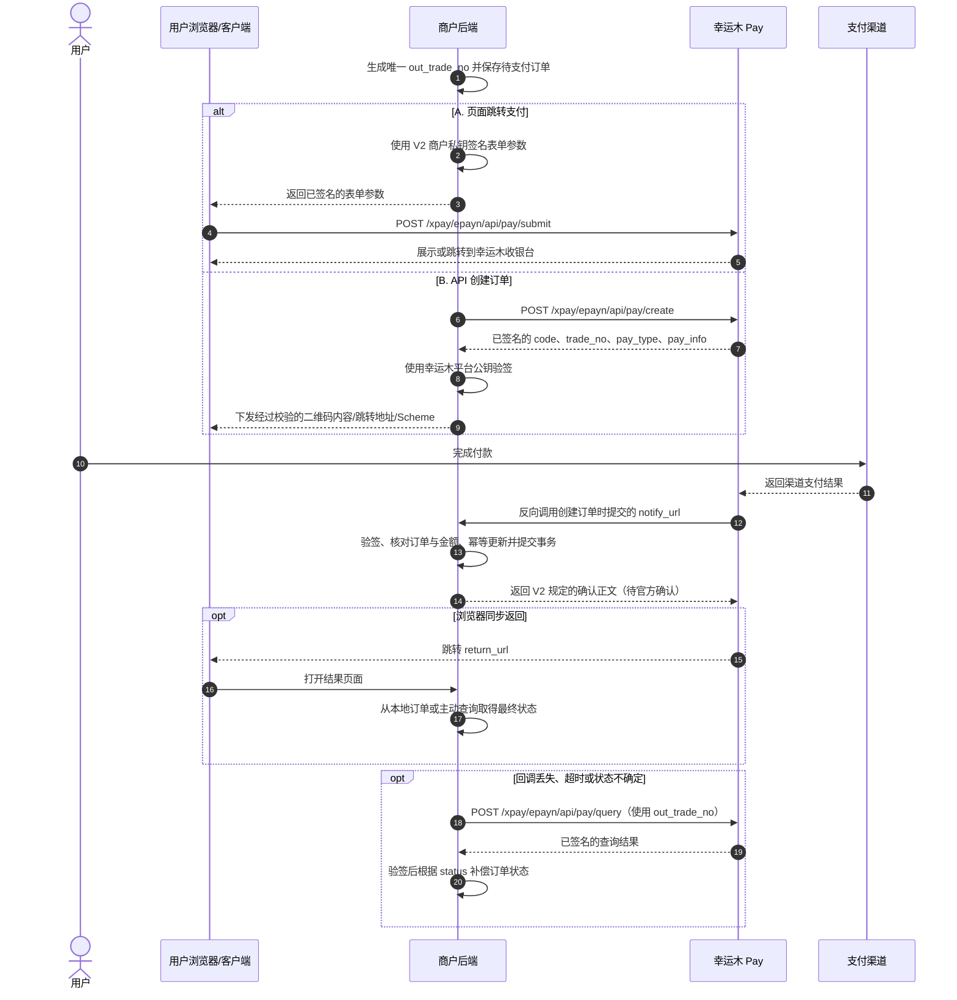

# 幸运木 Pay V2（RSA-SHA256）接口对接说明

> 文档定位：本文件是后续开发幸运木 Pay V2 对接时的唯一协议依据。
>
> 核对日期：2026-08-19。
>
> 覆盖范围：页面跳转支付、API 创建订单、异步支付回调、主动查询订单。
>
> 不覆盖范围：旧版 MD5 协议、幸运木后台通道账号配置、支付宝或微信开放平台配置、具体 Java DTO 与数据库表设计。

## 0. 阅读规则与当前结论

本文使用以下标记区分信息可靠程度：

| 标记 | 含义 | 开发要求 |
| --- | --- | --- |
| **官方已确认** | 幸运木当前 V2 开发页面已经明确给出的接口、字段或规则 | 可以直接作为实现依据 |
| **本地安全要求** | 为保证资金、密钥和订单状态安全而必须遵守的接入约束 | 即使官方示例省略也必须执行 |
| **待官方确认** | 当前公开 V2 页面没有完整说明 | 属于协议阻塞项，禁止根据行业惯例自行补全 |
| **旧版风险提示** | 只来自旧版 MD5 文档 | 仅帮助理解概念，不得决定 V2 实现 |

能够直接下结论的内容如下：

1. 页面跳转支付和 API 创建订单都会创建幸运木订单，但它们是两种不同的下单入口，业务流程中二选一。
2. 页面跳转支付由浏览器提交后进入幸运木收银台；API 创建订单由商户后端请求并取得二维码内容、跳转地址或客户端 Scheme。
3. 两种下单方式都必须在创建订单时提交 `notify_url`。
4. 用户支付后，应由幸运木服务器反向请求商户的 `notify_url`；浏览器访问 `return_url` 不能证明支付成功。
5. 商户可以使用自己的 `out_trade_no` 主动查询订单，不必先知道幸运木的 `trade_no`。
6. 查询响应中 `code=0` 只表示查询接口调用成功；只有 `status=1` 才表示订单已支付。
7. 当前公开资料没有完整给出 V2 回调的方法、字段表、确认正文和重试策略，这部分必须先向幸运木确认。

## 1. 协议总览

### 1.1 完整调用流程



### 1.2 调用方向

| 流程 | 请求方向 | 是否创建订单 | 主要返回形式 | 最终支付依据 |
| --- | --- | --- | --- | --- |
| 页面跳转支付 | 用户浏览器 → 幸运木 | 是 | 幸运木收银台页面或跳转行为 | 异步回调或主动查询 |
| API 创建订单 | 商户后端 → 幸运木 | 是 | 已签名的 JSON 数据 | 异步回调或主动查询 |
| 异步支付回调 | 幸运木 → 商户后端 | 否 | 商户确认正文 | 验签、金额校验和本地幂等落库 |
| 主动查询订单 | 商户后端 → 幸运木 | 否 | 已签名的 JSON 数据 | 验签成功且 `code=0`、`status=1` |

> **本地安全要求**：V2 商户私钥只能存在于商户后端。即使页面跳转支付最终由浏览器提交，签名也必须在后端生成，禁止把私钥或签名能力放进前端。

### 1.3 核心名词

| 名称 | 含义 | 所有者/来源 | 使用规则 |
| --- | --- | --- | --- |
| `pid` | 幸运木商户 ID | 幸运木商户后台 | 不是支付宝 App ID，也不是支付渠道交易号；示例统一使用占位值 |
| `out_trade_no` | 商户自己的订单号 | 商户系统生成 | 在商户范围内必须唯一、不可变；创建、回调匹配和查询均使用它 |
| `trade_no` | 幸运木平台订单号 | 幸运木创建订单后生成 | 收到可信响应后保存，用于对账或查询；不能代替本地订单号 |
| `api_trade_no` | 支付宝、微信等支付渠道的交易号 | 上游支付渠道 | 通常在查询结果中用于渠道对账，不由商户生成 |
| `notify_url` | 商户服务器异步回调地址 | 商户在创建订单时提交 | 两种下单方式均必填；必须为公网可访问的后端 HTTPS 地址 |
| `return_url` | 用户付款后的浏览器同步返回地址 | 商户在创建订单时提交 | 可选；只用于用户体验，不能作为支付成功依据 |
| `pay_type` | API 创建订单返回的支付载体类型 | 幸运木响应 | 已确认值包括 `qrcode`、`jump`、`urlscheme` |
| `pay_info` | 与 `pay_type` 对应的支付数据 | 幸运木响应 | 验签成功后才能交给前端使用 |
| `status` | 幸运木订单支付状态 | 查询响应 | 当前查询接口明确：`0` 未支付，`1` 已支付 |
| `param` | 商户自定义透传参数 | 商户提交，平台返回 | 可用于非敏感关联信息；不得放入密钥、令牌或个人敏感信息 |

## 2. V2 公共传输、安全与签名规范

### 2.1 接口根地址和公共请求头

本文使用以下生产地址表示幸运木接口根地址：

```text
https://xrpay.xymzf.cn
```

当前公开 V2 页面以接口路径和参数表为主，没有完整规定传输请求头：

| 项目 | 当前状态 | 对接要求 |
| --- | --- | --- |
| HTTPS | **官方页面接口地址已确认** | 只允许 HTTPS，禁止降级为 HTTP |
| `Content-Type` | **待官方确认** | 分别确认页面提交、API 创建和主动查询接受 JSON、表单还是两者 |
| `Accept` | **待官方确认** | API 调用可预期 JSON，但不得把未公开的固定值写死为协议事实 |
| `Authorization` | 当前 V2 参数表未列出该请求头 | 身份和完整性当前通过 `pid`、`timestamp`、`sign_type`、`sign` 表达 |
| 自定义幂等请求头 | 当前 V2 参数表未列出 | 使用 `out_trade_no` 实现业务幂等；平台重复订单号行为仍需确认 |

> 本文中的“逻辑请求参数”示例只用于说明字段和值，不代表幸运木已经确认 `application/json`。传输格式确认前，不得据此生成 HTTP 客户端代码。

### 2.2 官方已经确认的签名步骤

请求签名按以下顺序处理：

```text
原始请求参数
→ 排除 sign
→ 排除 sign_type
→ 排除值为空的参数
→ 剩余参数按字段名字典序升序排列
→ 拼接为 k1=v1&k2=v2
→ 使用幸运木 V2 商户私钥执行 RSA-SHA256 签名
→ 对签名结果进行 Base64 编码
→ 写入 sign
```

公共规则：

- `timestamp` 使用 10 位秒级时间戳。
- 请求由商户使用幸运木 V2 商户私钥签名。
- 幸运木响应和支付通知由幸运木平台私钥签名。
- 商户必须使用幸运木平台公钥验证响应和通知。
- `sign_type` 在公开参数表中为可选且默认 `RSA`；本项目应始终显式发送 `sign_type=RSA`，避免协议歧义。
- 商户 V2 私钥与支付宝应用私钥是两套完全不同的密钥，禁止混用。

### 2.3 编码细节的官方确认状态

以下细节会直接影响签名原文，当前公开 V2 页面没有完整说明，属于协议阻塞项：

| 问题 | 状态 | 未确认前的处理 |
| --- | --- | --- |
| 参数值按 UTF-8 还是其他字符集转换为字节 | **待官方确认** | 不自行选择并宣称为官方规则 |
| Base64 是标准 Base64 还是 URL-safe Base64 | **待官方确认** | 不混用两种编码 |
| URL 编码发生在签名前还是签名后 | **待官方确认** | 不对 `notify_url`、`return_url` 的签名值做推测性转换 |
| 空格、`+`、`%20`、中文和保留字符如何规范化 | **待官方确认** | 联调前准备专门用例与平台核对 |
| `money` 是否必须固定两位小数后再签名 | **待官方确认** | 业务内部统一使用十进制定点金额，签名文本按确认后的协议生成 |
| 时间戳允许的前后误差 | **待官方确认** | 保持服务器时钟同步，但不写死未确认窗口 |
| 平台响应和回调是否复用完全相同的原文构造规则 | **待官方确认** | 必须取得官方响应/回调验签样例 |

### 2.4 密钥与验签安全要求

1. V2 商户私钥只从 Secret 管理或环境变量加载，禁止提交到 Git、Markdown、YAML、测试数据、日志或前端。
2. 幸运木平台公钥必须固定配置并受变更审计，禁止从单次接口响应中动态信任一个新公钥。
3. API 创建、主动查询和异步回调中的平台数据，必须先验签，再读取金额、状态、`pay_info` 或更新订单。
4. 验签失败的数据视为不可信，不能因为 HTTP 200 或 `code=0` 而继续处理。
5. 日志只记录脱敏后的 `pid`、订单号摘要、错误类型和 `traceId`；禁止记录私钥、完整签名原文或完整通知体。
6. `notify_url` 必须由服务端配置生成，不能直接采用客户端提交的任意 URL。

## 3. 页面跳转支付

### 3.1 接口定义

```text
POST /xpay/epayn/api/pay/submit
```

完整示例地址：

```text
https://xrpay.xymzf.cn/xpay/epayn/api/pay/submit
```

| 项目 | 说明 |
| --- | --- |
| 调用方向 | 用户浏览器 → 幸运木 |
| 签名位置 | 商户后端生成签名，浏览器只提交已经签名的参数 |
| 用途 | 创建幸运木订单并进入幸运木收银台 |
| 请求体 | 按浏览器表单字段提交；精确 `Content-Type`/编码规则仍待官方确认 |
| 响应 | 收银台页面或浏览器跳转行为，不是普通业务 JSON 合同 |

### 3.2 请求参数

除 `sign`、`sign_type` 和空值外，实际提交的字段均参与签名。

| 字段 | 逻辑类型 | 必填 | 来源 | 脱敏示例 | 是否参与签名 |
| --- | --- | --- | --- | --- | --- |
| `pid` | 文本 | 是 | 幸运木商户配置 | `<XR_PAY_PID>` | 是 |
| `type` | 文本 | 否 | 商户选择的支付方式 | `alipay` | 非空时参与；不传时由收银台选择 |
| `out_trade_no` | 文本 | 是 | 商户订单系统 | `ORDER-20260819-0001` | 是 |
| `notify_url` | URL 文本 | 是 | 商户后端配置 | `https://merchant.example/payments/xrpay/notify` | 是 |
| `return_url` | URL 文本 | 否 | 商户前端/后端配置 | `https://merchant.example/payments/result` | 非空时参与 |
| `name` | 文本 | 是 | 商户订单 | `示例商品` | 是 |
| `money` | 十进制金额文本 | 是 | 商户订单 | `1.00` | 是 |
| `param` | 文本 | 否 | 商户生成的非敏感透传值 | `source=web` | 非空时参与 |
| `clientip` | IP 文本 | 否 | 商户后端可信代理链解析 | `192.0.2.10` | 非空时参与 |
| `device` | 文本 | 否 | 商户根据客户端判断 | `mobile` | 非空时参与；已知值包括 `pc`、`mobile` |
| `timestamp` | 10 位秒级时间戳文本 | 是 | 商户后端时钟 | `1787100000` | 是 |
| `sign_type` | 文本 | 否，建议显式传 | 固定配置 | `RSA` | 否 |
| `sign` | Base64 签名文本 | 是 | 商户后端签名结果 | `<BASE64_RSA_SHA256_SIGNATURE>` | 否 |

### 3.3 逻辑表单示例

下面只展示浏览器要提交的字段集合，不表示精确的表单编码已经得到官方确认：

```text
POST https://xrpay.xymzf.cn/xpay/epayn/api/pay/submit

pid=<XR_PAY_PID>
type=alipay
out_trade_no=ORDER-20260819-0001
notify_url=https://merchant.example/payments/xrpay/notify
return_url=https://merchant.example/payments/result
name=示例商品
money=1.00
param=source=web
clientip=192.0.2.10
device=mobile
timestamp=1787100000
sign_type=RSA
sign=<BASE64_RSA_SHA256_SIGNATURE>
```

实际实现应由商户后端生成一次性页面或表单模型，浏览器随后提交到幸运木；前端不得自行重新计算金额、订单号或签名。

### 3.4 响应和同步跳转

- 该接口的正常结果是浏览器进入幸运木收银台，而不是让商户后端解析一份创建订单 JSON。
- `return_url` 只代表浏览器返回路径。用户可能关闭页面、重复刷新、伪造访问或根本不返回。
- 结果页必须展示本地订单状态；若状态仍不确定，可由后端主动查询，禁止仅凭 URL 参数将订单标记为已支付。
- V2 接口已经接收 `money`，但不同通道账号/二维码模式是否仍要求用户输入金额，不属于当前 V2 接口字段合同，必须通过真实通道测试确认。

## 4. API 创建订单

### 4.1 接口定义

```text
POST /xpay/epayn/api/pay/create
```

完整示例地址：

```text
https://xrpay.xymzf.cn/xpay/epayn/api/pay/create
```

| 项目 | 说明 |
| --- | --- |
| 调用方向 | 商户后端 → 幸运木 |
| 用途 | 创建幸运木订单并取得二维码内容、跳转地址或客户端唤起 Scheme |
| 请求体格式 | **待官方确认**：JSON、表单或两者是否均支持 |
| 请求头 | **待官方确认**：精确 `Content-Type` 和 `Accept` |
| 响应 | 当前 V2 页面给出了 JSON 字段和示例；响应必须验平台签名 |

### 4.2 请求参数

| 字段 | 逻辑类型 | 必填 | 来源 | 脱敏示例 | 是否参与签名 |
| --- | --- | --- | --- | --- | --- |
| `pid` | 文本 | 是 | 幸运木商户配置 | `<XR_PAY_PID>` | 是 |
| `type` | 文本 | 是 | 商户选择的支付方式 | `wxpay` | 是；已知示例包括 `alipay`、`wxpay`、`qqpay` |
| `method` | 文本 | 否 | 商户选择的支付场景 | `web` | 非空时参与；默认 `web`，已知值包括 `web`、`jump`、`jsapi`、`app`、`scan`、`applet` |
| `device` | 文本 | 否 | 商户根据客户端判断 | `mobile` | 非空时参与；已知值包括 `pc`、`mobile`、`qq`、`wechat`、`alipay` |
| `out_trade_no` | 文本 | 是 | 商户订单系统 | `ORDER-20260819-0002` | 是 |
| `notify_url` | URL 文本 | 是 | 商户后端配置 | `https://merchant.example/payments/xrpay/notify` | 是 |
| `return_url` | URL 文本 | 否 | 商户配置 | `https://merchant.example/payments/result` | 非空时参与 |
| `name` | 文本 | 是 | 商户订单 | `示例商品` | 是 |
| `money` | 十进制金额文本 | 是 | 商户订单 | `1.00` | 是 |
| `clientip` | IP 文本 | 否 | 商户后端可信代理链解析 | `192.0.2.10` | 非空时参与 |
| `param` | 文本 | 否 | 商户生成的非敏感透传值 | `source=api` | 非空时参与 |
| `auth_code` | 文本 | 否/条件必填 | 用户付款码扫描场景 | `<PAYER_AUTH_CODE>` | 非空时参与；扫描付款码时必填 |
| `sub_openid` | 文本 | 否/条件必填 | JSAPI/小程序场景 | `<MASKED_OPENID>` | 非空时参与 |
| `sub_appid` | 文本 | 否/条件必填 | JSAPI/小程序配置 | `<SUB_APP_ID>` | 非空时参与 |
| `timestamp` | 10 位秒级时间戳文本 | 是 | 商户后端时钟 | `1787100000` | 是 |
| `sign_type` | 文本 | 否，建议显式传 | 固定配置 | `RSA` | 否 |
| `sign` | Base64 签名文本 | 是 | 商户后端签名结果 | `<BASE64_RSA_SHA256_SIGNATURE>` | 否 |

### 4.3 逻辑请求示例

> 此 JSON 只用于表达参数集合，不代表幸运木已经确认请求体必须为 `application/json`。

```json
{
  "pid": "<XR_PAY_PID>",
  "type": "wxpay",
  "method": "web",
  "device": "mobile",
  "out_trade_no": "ORDER-20260819-0002",
  "notify_url": "https://merchant.example/payments/xrpay/notify",
  "return_url": "https://merchant.example/payments/result",
  "name": "示例商品",
  "money": "1.00",
  "clientip": "192.0.2.10",
  "param": "source=api",
  "timestamp": "1787100000",
  "sign_type": "RSA",
  "sign": "<BASE64_RSA_SHA256_SIGNATURE>"
}
```

### 4.4 响应参数

| 字段 | JSON 类型 | 含义 | 处理要求 |
| --- | --- | --- | --- |
| `code` | 数字 | 接口调用结果码 | V2 中 `0` 表示创建接口调用成功；不等同于用户已付款 |
| `msg` | 文本 | 结果说明 | 只用于诊断，不据此判断支付成功 |
| `trade_no` | 文本 | 幸运木平台订单号 | 验签后与本地 `out_trade_no` 关联保存 |
| `pay_type` | 文本 | `pay_info` 的载体类型 | 当前确认值：`qrcode`、`jump`、`urlscheme` |
| `pay_info` | 文本 | 二维码内容、跳转 URL 或客户端 Scheme | 验签成功后才允许交给前端 |
| `timestamp` | 文本 | 幸运木响应时间戳 | 参与响应验签；允许误差待确认 |
| `sign` | 文本 | 幸运木平台签名 | 使用固定配置的平台公钥验签 |
| `sign_type` | 文本 | 签名类型 | V2 应为 `RSA` |

`pay_type` 与 `pay_info` 的对应关系：

| `pay_type` | `pay_info` 内容 | 客户端处理 |
| --- | --- | --- |
| `qrcode` | 二维码原始内容 | 商户前端可以将该内容渲染为二维码 |
| `jump` | 跳转地址 | 验签后按 URL 允许列表和 HTTPS 规则跳转 |
| `urlscheme` | 客户端唤起 Scheme | 验签后按 Scheme 允许列表处理，禁止无校验自动执行 |

### 4.5 响应示例

```json
{
  "code": 0,
  "msg": "success",
  "trade_no": "XR-20260819-FAKE-0001",
  "pay_type": "qrcode",
  "pay_info": "weixin://wxpay/bizpayurl?pr=FAKE_VALUE",
  "timestamp": "1787100001",
  "sign": "<PLATFORM_BASE64_RSA_SHA256_SIGNATURE>",
  "sign_type": "RSA"
}
```

正确处理顺序：

```text
收到 HTTP 响应
→ 解析响应字段
→ 检查 sign_type=RSA
→ 使用幸运木平台公钥验签
→ 检查 code=0
→ 保存 trade_no
→ 根据 pay_type 处理 pay_info
```

如果创建请求超时或连接中断，不能直接生成新的 `out_trade_no` 再创建。应先使用原 `out_trade_no` 主动查询：

- 已存在且已支付：按已支付结果处理。
- 已存在但未支付：继续使用原订单，是否允许重复创建仍待官方确认。
- 查询明确不存在：是否可用相同 `out_trade_no` 重试创建，必须以幸运木重复订单号规则为准。
- 查询同样超时：保持本地“支付结果未知”，进入有界重试或人工核对，不得当作创建失败。

## 5. 异步支付回调

### 5.1 回调地址来自 `notify_url`

异步回调不是一个由幸运木固定提供、需要商户主动请求的 URL。它是商户在创建订单时提交给幸运木的服务器地址，例如：

```text
notify_url=https://merchant.example/payments/xrpay/notify
```

用户支付完成后，请求方向是：

```text
幸运木服务器 → 商户 notify_url
```

当前 V2 官方资料已经确认平台响应和通知由平台私钥签名、商户使用平台公钥验签；但公开页面没有给出完整回调合同。

### 5.2 当前协议阻塞项

下列信息在开发回调 Controller 前必须由幸运木客服或一份可追溯的 V2 协议补齐：

| 待确认项 | 为什么阻塞实现 |
| --- | --- |
| 回调使用 GET、POST，还是两者都支持 | 决定路由、参数绑定和网关规则 |
| 回调 `Content-Type` | 决定按查询参数、表单还是 JSON 解析 |
| 完整字段表、类型和必填性 | 当前不能安全映射 `pid`、订单号、金额、状态和签名 |
| 成功状态字段名称与取值 | 不能把旧版 `trade_status=TRADE_SUCCESS` 当作 V2 事实 |
| 回调签名参与字段与原文构造 | 决定是否能够正确验签 |
| 回调确认响应正文 | 不能把旧版纯文本 `success` 当作 V2 事实 |
| 非 2xx、超时、验签失败时的重试次数和间隔 | 决定幂等保留期、监控和容量 |
| 通知时间戳有效窗口与重放规则 | 决定防重放校验 |

> **旧版风险提示**：旧版 MD5 回调文档出现过 `trade_status=TRADE_SUCCESS` 和纯文本 `success`。这些只能说明旧版概念，不能复制进 V2 实现。

### 5.3 语义处理顺序

在完整字段名称得到确认后，回调必须按以下顺序处理：

```text
接收通知
→ 按官方 V2 传输格式解析字段
→ 使用幸运木平台公钥验证 RSA-SHA256 签名
→ 校验 pid 等于本商户配置
→ 根据 out_trade_no 查询本地订单
→ 校验通知金额等于本地订单金额
→ 校验通知状态确实表示支付成功
→ 幂等更新本地订单
→ 提交数据库事务
→ 返回幸运木 V2 规定的确认内容
```

伪代码使用语义字段名，不假定幸运木尚未公开的 V2 字段名称：

```text
handleXrPayNotification(httpRequest):
    notification = parseByConfirmedV2Contract(httpRequest)

    if !verifyPlatformRsaSha256(notification):
        recordSecurityEvent("invalid_signature")
        return confirmedV2FailureAck()

    require notification.merchantId == configuredPid

    order = findLocalOrder(notification.merchantOrderNo)
    require order exists
    require decimal(notification.paidMoney) == order.expectedMoney
    require notification.paymentState == confirmedV2PaidState

    begin transaction
        updated = markPaidOnlyWhenCurrentlyUnpaid(
            order,
            notification.platformTradeNo,
            notification.channelTradeNo
        )
        if !updated:
            require order.alreadyPaidWithSameFacts
    commit transaction

    return confirmedV2SuccessAck()
```

### 5.4 幂等规则

- 本地 `out_trade_no` 必须有唯一约束或等价的强一致幂等保障。
- 首次合法回调只允许产生一次“未支付 → 已支付”状态迁移。
- 相同订单的重复合法回调不得重复记账、重复发货或重复增加权益。
- 已支付订单收到金额、`trade_no` 或渠道事实不一致的回调时，不得覆盖原记录，必须报警并进入人工核对。
- 数据库提交成功前不能返回成功确认，否则平台可能停止重试而本地状态尚未落库。
- 回调处理与后续发货/权益发放需要分别具备幂等性；支付状态成功不等于后续副作用一定执行成功。

## 6. 主动查询订单

### 6.1 接口定义

```text
POST /xpay/epayn/api/pay/query
```

完整示例地址：

```text
https://xrpay.xymzf.cn/xpay/epayn/api/pay/query
```

| 项目 | 说明 |
| --- | --- |
| 调用方向 | 商户后端 → 幸运木 |
| 用途 | 主动读取幸运木订单状态，补偿回调丢失、创建超时或本地状态不确定 |
| 请求体格式 | **待官方确认**：JSON、表单或两者是否均支持 |
| 订单标识 | `trade_no` 与 `out_trade_no` 二选一 |
| 响应 | 已签名 JSON；必须验签 |

### 6.2 请求参数

| 字段 | 逻辑类型 | 必填 | 来源 | 脱敏示例 | 是否参与签名 |
| --- | --- | --- | --- | --- | --- |
| `pid` | 文本 | 是 | 幸运木商户配置 | `<XR_PAY_PID>` | 是 |
| `trade_no` | 文本 | 二选一 | 已保存的幸运木订单号 | `XR-20260819-FAKE-0001` | 非空时参与 |
| `out_trade_no` | 文本 | 二选一 | 商户本地订单号 | `ORDER-20260819-0002` | 非空时参与 |
| `timestamp` | 10 位秒级时间戳文本 | 是 | 商户后端时钟 | `1787100060` | 是 |
| `sign_type` | 文本 | 否，建议显式传 | 固定配置 | `RSA` | 否 |
| `sign` | Base64 签名文本 | 是 | 商户后端签名结果 | `<BASE64_RSA_SHA256_SIGNATURE>` | 否 |

商户可以直接使用自己的订单号查询：

```json
{
  "pid": "<XR_PAY_PID>",
  "out_trade_no": "ORDER-20260819-0002",
  "timestamp": "1787100060",
  "sign_type": "RSA",
  "sign": "<BASE64_RSA_SHA256_SIGNATURE>"
}
```

> 上述 JSON 仍然只是逻辑参数示例，不代表请求体格式已经得到官方确认。不要同时提交 `trade_no` 和 `out_trade_no`，以免产生优先级歧义。

### 6.3 响应参数

| 字段 | JSON 类型 | 含义 | 处理要求 |
| --- | --- | --- | --- |
| `code` | 数字 | 查询接口调用结果 | `0` 表示查询成功，不表示已付款 |
| `msg` | 文本 | 查询结果说明 | 只用于诊断 |
| `trade_no` | 文本 | 幸运木平台订单号 | 验签后保存/核对 |
| `out_trade_no` | 文本 | 商户订单号 | 必须与请求和本地订单匹配 |
| `api_trade_no` | 文本 | 支付渠道交易号 | 用于对账，可能为空 |
| `type` | 文本 | 支付方式 | 与订单预期渠道核对 |
| `status` | 数字 | 支付状态 | `0` 未支付，`1` 已支付 |
| `pid` | 文本 | 幸运木商户 ID | 必须与本商户配置匹配 |
| `addtime` | 文本 | 平台订单创建时间 | 保存时明确时区；官方时区规则待确认 |
| `endtime` | 文本 | 平台订单完成时间 | 未支付时可能为空 |
| `name` | 文本 | 商品名称 | 只作核对，不作为本地商品事实来源 |
| `money` | 文本 | 订单金额 | 必须按十进制定点数与本地金额严格比较 |
| `param` | 文本 | 商户透传参数 | 不作为支付成功的唯一依据 |
| `buyer` | 文本 | 买方信息 | 可能为空；按敏感数据处理 |
| `clientip` | 文本 | 创建订单时的客户端 IP | 可能为空；日志中必须脱敏 |
| `timestamp` | 文本 | 幸运木响应时间戳 | 参与验签；有效窗口待确认 |
| `sign` | 文本 | 幸运木平台签名 | 使用平台公钥验签 |
| `sign_type` | 文本 | 签名类型 | V2 应为 `RSA` |

### 6.4 响应示例

```json
{
  "code": 0,
  "msg": "success",
  "trade_no": "XR-20260819-FAKE-0001",
  "out_trade_no": "ORDER-20260819-0002",
  "api_trade_no": "CHANNEL-FAKE-0001",
  "type": "wxpay",
  "status": 1,
  "pid": "<XR_PAY_PID>",
  "addtime": "2026-08-19 12:00:00",
  "endtime": "2026-08-19 12:01:00",
  "name": "示例商品",
  "money": "1.00",
  "param": "source=api",
  "buyer": "",
  "clientip": "192.0.2.10",
  "timestamp": "1787100061",
  "sign": "<PLATFORM_BASE64_RSA_SHA256_SIGNATURE>",
  "sign_type": "RSA"
}
```

支付成功必须同时满足：

```text
HTTP 响应可解析
AND 平台 RSA-SHA256 签名有效
AND code = 0
AND pid = 本商户 PID
AND out_trade_no = 本地订单号
AND money = 本地订单金额
AND status = 1
```

HTTP 200、`msg=success` 或 `code=0` 中任意一个单独出现，都不能证明用户已经付款。

## 7. 签名、示例和错误处理

### 7.1 请求签名示例

以下全部为虚构数据。假设 API 创建订单的原始逻辑参数是：

```text
pid=<XR_PAY_PID>
type=alipay
method=web
device=
out_trade_no=ORDER-20260819-0003
notify_url=https://merchant.example/payments/xrpay/notify
return_url=
name=示例商品
money=1.00
timestamp=1787100100
sign_type=RSA
sign=
```

第一步，排除：

- `sign`；
- `sign_type`；
- 空值 `device`；
- 空值 `return_url`。

第二步，按字段名字典序升序排列：

```text
method
money
name
notify_url
out_trade_no
pid
timestamp
type
```

第三步，拼接待签名字符串：

```text
method=web&money=1.00&name=示例商品&notify_url=https://merchant.example/payments/xrpay/notify&out_trade_no=ORDER-20260819-0003&pid=<XR_PAY_PID>&timestamp=1787100100&type=alipay
```

第四步：

```text
signatureBytes = RSA-SHA256-SIGN(v2MerchantPrivateKey, bytes(toSignString))
sign = BASE64(signatureBytes)
```

最终提交时增加：

```text
sign_type=RSA
sign=<BASE64_RSA_SHA256_SIGNATURE>
```

> 示例没有决定字符串转字节的字符集，也没有决定 URL 编码顺序；这两项仍是协议阻塞项。不要把示例中的表面字符串直接写成不可更改的生产签名实现。

### 7.2 回调与查询的互补关系

| 场景 | 首选动作 | 补偿动作 |
| --- | --- | --- |
| 正常支付完成 | 接收并处理异步回调 | 定时查询仍未收敛的待支付订单 |
| 回调验签失败 | 拒绝信任通知并记录安全事件 | 使用商户后端主动查询 |
| 回调未到达 | 保持本地待支付 | 按原 `out_trade_no` 主动查询 |
| 创建请求超时 | 不生成新订单号 | 按原 `out_trade_no` 查询 |
| 用户返回结果页 | 展示本地状态 | 后端按需查询，不能信任浏览器参数 |

查询补偿必须有次数、退避和总时间上限，避免无限轮询；超过期限的订单进入“已关闭/待人工核对”等本地状态，具体期限由业务规则确定。

### 7.3 失败和异常处理表

| 情况 | 能否标记已支付 | 处理方式 |
| --- | --- | --- |
| HTTP 非 2xx、连接失败或响应超时 | 否 | 状态记为未知；使用原 `out_trade_no` 查询，禁止直接换号创建 |
| 响应无法解析 | 否 | 保存脱敏错误上下文并报警；随后主动查询 |
| `sign_type` 不是 `RSA` | 否 | 按协议不匹配拒绝处理并报警 |
| 平台签名无效 | 否 | 将响应/通知视为不可信，禁止使用其中的金额、状态或 `pay_info` |
| API 创建响应 `code != 0` | 否 | 不向前端提供 `pay_info`；按错误码/说明进入失败或重试流程 |
| 查询 `code=0`、`status=0` | 否 | 订单仍未支付，可按有界策略继续等待或查询 |
| 查询 `code=0`、`status=1` 且验签、订单、金额均匹配 | 是 | 幂等更新本地订单并触发一次后续流程 |
| 回调金额与本地金额不一致 | 否 | 不覆盖订单，不发货；报警并人工核对 |
| 回调订单不存在 | 否 | 不自动创建本地订单；记录事件并查询/人工核对，确认正文按 V2 合同返回 |
| 重复合法回调 | 保持原结果 | 幂等返回，不重复记账、发货或加权益 |
| 已支付订单收到不同 `trade_no`/金额 | 不改变原结果 | 按冲突事件报警并人工核对 |
| `return_url` 显示成功但本地仍未支付 | 否 | 展示“结果确认中”，由后端主动查询 |

### 7.4 最小对账记录

协议层至少需要可靠保存下列事实，具体表结构不在本文范围内：

```text
out_trade_no          商户订单号，唯一且不可变
trade_no              幸运木平台订单号
api_trade_no          上游渠道交易号（如有）
pid                   所属幸运木商户
expected_money        商户订单应付金额
paid_money            验签并核对后的平台金额
payment_status        本地支付状态
created_at            本地订单创建时间
paid_at               确认支付时间
last_query_at         最近主动查询时间
notification_digest   回调去重摘要，不保存敏感原文
```

## 8. 官方资料、风险边界与待确认清单

### 8.1 资料优先级

后续若资料发生冲突，按以下顺序处理：

1. [幸运木当前开发文档页面](https://xrpay.xymzf.cn/doc)中明确标识为 V2/RSA 的内容。
2. 幸运木客服提供并能确认版本、日期的 V2 协议说明。
3. 真实测试环境中取得的脱敏请求、响应与回调，并由幸运木确认其属于 V2。
4. [幸运木语雀教程](https://www.yuque.com/lucky_fan/xymzf/sq6oehzqo5qzqryr)可用于理解后台操作，但只有明确的 V2 协议字段才能进入实现。
5. [旧版 API 支付文档](https://xrpay.xymzf.cn/docs/epay_mapi.md)和[旧版支付通知文档](https://xrpay.xymzf.cn/docs/epay_notify.md)只能帮助理解概念，不能决定 V2 字段、签名、状态或确认正文。

> 幸运木文档页面由前端动态加载，页面部署版本可能变化。每次正式开发或联调前，都应重新核对接口路径、字段表和页面更新时间；任何变化必须同步更新本文后再改代码。

### 8.2 可直接发给幸运木客服的确认问题

```text
您好，我们正在对接幸运木 Pay V2（RSA-SHA256），请按当前生产版本确认以下协议细节，并尽量提供一份完整、可复制的 V2 请求/响应/回调示例：

1. POST /xpay/epayn/api/pay/submit 的 Content-Type 和字符集是什么？URL 编码发生在签名前还是签名后？
2. POST /xpay/epayn/api/pay/create 接受 application/json、application/x-www-form-urlencoded，还是两者都支持？必须发送哪些请求头？
3. POST /xpay/epayn/api/pay/query 接受 application/json、application/x-www-form-urlencoded，还是两者都支持？必须发送哪些请求头？
4. V2 异步回调使用 GET、POST，还是两者都可能？Content-Type 是什么？
5. 请提供 V2 回调完整字段表（字段名、类型、必填性、示例），以及表示“支付成功”的准确字段和值。
6. V2 回调验签时，需要排除哪些字段？空值如何判断？待验签原文如何排序和拼接？
7. 请求、响应和回调签名结果使用标准 Base64 还是 Base64URL？是否带 = 填充？
8. 所有签名原文是否固定使用 UTF-8？中文、空格、+、%20、&、= 和 URL 参数如何编码？
9. 10 位 timestamp 允许的前后误差是多少？超出窗口的错误码是什么？
10. 相同 pid + out_trade_no 重复创建时，平台是幂等返回原订单、报重复，还是创建新订单？创建请求超时后的官方重试方式是什么？
11. V2 回调处理成功后，商户必须返回什么 HTTP 状态、Content-Type 和正文？是否区分大小写、换行或空格？
12. 回调未确认、超时或非 2xx 时，平台会重试多少次？具体时间间隔和最长重试期限是多少？
13. 平台响应和回调是否都复用同一套“排除 sign/sign_type/空值、字典序、k=v&...”原文构造规则？
14. API 创建响应的 code=0 是否只表示创建成功？查询响应的 status 是否只有 0=未支付、1=已支付，是否还有关闭、退款等其他状态？
15. 请提供平台公钥轮换方式、提前通知周期，以及新旧公钥并行验签窗口。
```

### 8.3 协议阻塞项完成标准

只有同时满足以下条件，才可以把回调和 HTTP 传输格式从“待官方确认”改为“可实现”：

- 获得可追溯到具体 V2 版本的官方书面答复。
- 至少有一组完全脱敏的创建请求、创建响应、支付回调和查询响应。
- 使用官方示例可以独立复现请求签名和平台验签。
- 明确回调成功确认正文和重试策略。
- 明确重复 `out_trade_no`、创建超时和查询不到订单时的行为。
- 将确认结果更新到本文，并记录确认日期和来源。

## 9. 开发前检查清单

- [ ] 选择页面跳转支付或 API 创建订单作为当前业务入口，不在同一笔订单中混用两种入口。
- [ ] `out_trade_no` 由商户后端生成，唯一、不可变，并在调用幸运木前持久化。
- [ ] 两种下单方式均传入后端 HTTPS `notify_url`。
- [ ] `return_url` 只用于结果页，不参与支付成功判定。
- [ ] 签名代码只使用幸运木 V2 商户私钥，不使用支付宝应用私钥。
- [ ] 创建响应、查询响应和回调均先验平台签名，再读取业务字段。
- [ ] 金额使用十进制定点类型比较，不使用浮点数。
- [ ] 创建超时先按原 `out_trade_no` 查询，不立即换号创建。
- [ ] 回调更新和后续发货/权益操作均具有幂等保障。
- [ ] `code=0` 与 `status=1` 被建模为两个不同判断。
- [ ] 所有“待官方确认”项已经取得书面答复并回填本文。
- [ ] 示例、日志和配置中不存在真实 PID、App ID、私钥、平台密钥或用户信息。

